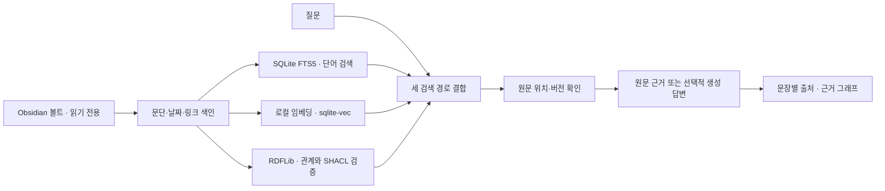

# Obsi Onto

로컬 Obsidian 볼트에 질문하고, 답변의 노트·문단·줄 위치를 확인하는 단일 사용자 앱입니다.

**SQLite FTS5 + sqlite-vec + RDFLib/SHACL**을 사용합니다. 원본 Markdown은 수정하지 않습니다. 생성 모델 없이도 원문 근거 검색을 사용할 수 있습니다.

## 1차 구현 범위

| 기능 | 할 수 있는 일 |
|---|---|
| 볼트 연결 | Finder에서 로컬·iCloud 폴더 선택, 비공개 경로 제외 |
| 질문과 출처 | 단어·의미·관계 검색, 원문 문단·기록일·줄·버전 확인 |
| 생성 답변 | 선택한 근거로 요약·비교, 문장별 인용, 실패 시 원문 표시 |
| 예상 질문 | 볼트 설정 변경 후 최대 6개 재생성, 참고 노트·생성 시각 표시 |
| 지식 그래프 | 노트·문단·태그·주제와 검토한 관계 탐색, 선택·검색 결과 강조 |
| 자동 갱신 | 파일 알림에 따른 증분 색인, 누락을 보완하는 메타데이터 대조 |

이 앱의 온톨로지는 노트의 명시 링크·속성·사용자가 확인한 관계를 연결하는 구조입니다. 검색된 유사 문장을 사실 관계로 자동 확정하지 않습니다.



## 빠른 시작

### 준비 사항

- **macOS, Python 3.12** 기준으로 검증했습니다. Python 지원 범위는 3.12–3.13입니다. Finder 폴더 선택은 macOS 전용입니다.
- Git과 [uv](https://docs.astral.sh/uv/)가 필요합니다. Node.js는 JavaScript 구문 검사에만 사용하며 앱 실행에는 필요하지 않습니다.
- 처음 의존성·공개 임베딩 모델을 받을 때 인터넷 연결이 필요합니다. API 키는 선택 사항입니다.

### 설치와 실행

초기 개발 PR을 검토하는 동안은 구현 브랜치를 내려받습니다.

```sh
git clone --branch feat/initial-mvp https://github.com/espseongsm/obsi-onto.git
cd obsi-onto
uv sync --locked --python 3.12
uv run main.py
```

PR이 `main`에 병합된 뒤에는 `--branch feat/initial-mvp` 없이 복제할 수 있습니다.

[로컬 앱 열기](http://127.0.0.1:8765)

처음에는 **가상의 업무·투자 노트로 먼저 둘러보기**를 누르면 API 키 없이 검색·출처·그래프를 확인할 수 있습니다. 이후 개인 볼트로 전환하려면 **볼트 설정 → 로컬 색인과 기록 삭제**로 샘플 연결을 해제하고 개인 폴더를 연결하세요. 삭제 대상은 앱의 색인과 질문 기록이며 원본 노트는 남습니다.

포트를 바꾸려면 `uv run main.py --port 8766`을 사용합니다. `Ctrl+C`로 종료하고 같은 명령으로 다시 실행합니다. 로그인 시 자동 실행은 설치하지 않습니다.

### 선택 사항: .env 준비

모델 API나 저장 위치를 설정할 때만 `.env.example`을 `.env`로 복사합니다. 기존 `.env`가 있으면 아래 명령은 덮어쓰지 않습니다.

```sh
cp -n .env.example .env
chmod 600 .env
```

복사 직후에는 외부 API를 호출하지 않습니다. API 주소·키·모델과 해당 전송 허용을 설정한 뒤 실행하세요. `main.py`는 프로젝트의 `.env`를 자동으로 읽고, 이미 지정한 실행 환경변수를 우선합니다. `.env` 변경 후에는 서버를 재시작해야 합니다. `.env`와 개인 화면 캡처·로컬 DB는 Git에서 제외됩니다.

## 처음 볼트를 연결할 때

1. **Finder로 선택**을 눌러 로컬·iCloud Drive의 볼트 폴더를 고르거나 경로를 직접 입력합니다. 선택 후 **볼트 연결**을 누릅니다. **볼트 설정** 화면에서도 같은 버튼을 사용할 수 있습니다. 처음에는 **가상의 업무·투자 노트로 둘러보기**도 가능합니다.
2. 연결과 함께 제외 규칙을 적용하려면 **볼트 설정**에서 경로와 규칙을 한 번에 저장합니다. 규칙은 한 줄에 하나씩 `Private`, `Archive/**`처럼 볼트 안의 상대 경로로 입력합니다. `.obsidian`, `.git`, `.trash`, 심볼릭 링크는 기본 제외합니다. 자동 외부 예상 질문을 켠 경우에도 이 규칙을 적용합니다.
3. **로컬 의미 검색 모델 준비**를 누르면 공개 다국어 MiniLM 모델을 한 번 다운로드합니다. 이후 노트와 질문의 임베딩은 CPU에서 로컬로 계산합니다. 모델 준비 전에는 단어·명시 관계 검색을 제공합니다.
4. 질문하면 검증된 원문 근거, 기록일, 노트 경로, 줄 번호, 검색 경로가 표시됩니다.
5. 볼트를 연결하면 **볼트에서 뽑은 예상 질문**을 최대 6개 제공합니다. 설정이 바뀌면 색인 후 다시 만들며, 선택하면 질문·영역이 입력됩니다. **지식 그래프**와 질문 결과의 **근거 그래프**에서 문단을 선택하면 직접 연결된 기록이 강조되고 원문을 확인할 수 있습니다.

볼트는 한 번에 하나만 연결합니다. 다른 폴더로 바꾸려면 기존 로컬 색인과 기록을 삭제한 뒤 연결합니다. 질문 기록을 유지해야 한다면 삭제 전에 필요한 답변을 별도로 보관하세요.

### 질문·그래프·관계 검토 사용법

1. **기록에 질문하기:** 예상 질문을 선택하거나 직접 입력합니다. 회사 업무·투자 일지·개인 생각 또는 모든 기록을 고르고, 필요하면 기록일 범위를 지정합니다. **근거 찾기** 또는 `⌘/Ctrl + Enter`로 실행합니다.
2. **답변 확인:** 생성 모델이 꺼져 있으면 원문 발췌, 켜져 있으면 인용된 생성 답변을 표시합니다. 근거 카드에서 기록일·노트 경로·줄 번호를 확인하고 **Obsidian에서 원문 열기**로 이동합니다.
3. **그래프 탐색:** **지식 그래프**에서 이름이나 본문 글자를 찾습니다. 질문 결과의 **근거 그래프**에서는 답변에 쓰인 문단과 연결을 탐색합니다. 검색 일치는 초록, 선택한 노드는 주황으로 표시하고 직접 연결된 노드·선을 강조합니다. 노드 간 배치 거리는 의미 유사도가 아닙니다.
4. **관계 검토:** 생성 모델이 켜져 있으면 답변 아래 **이 근거에서 의미 관계 후보 제안**을 누릅니다. **관계 검토**에서 원문을 보고 확인하거나 거절합니다. 확인 전 후보는 확정 관계 조회에 넣지 않습니다.
5. **이전 질문:** 왼쪽의 최근 질문을 누르면 당시 근거·그래프를 엽니다. 과거 결과는 현재 파일 상태와 다를 수 있습니다.

샘플 질문: “프로젝트 B의 방향을 바꾼 이유는 무엇인가?”, “A기업에 대한 투자 판단은 어떻게 달라졌나?”, “내 투자 원칙과 연결된 분석을 찾아줘”. 개인 볼트에서는 실제 노트에 있는 이름으로 바꿔 질문하세요. [질문 시나리오 상세](docs/question-scenarios.md)

## 저장과 갱신

- 예상 질문은 최초 연결, 경로·제외 규칙·파일명 날짜 해석 변경 후에 생성해 SQLite에 보관합니다. 기존 볼트에 저장된 질문이 없으면 다음 시작 때 한 번 만듭니다. 같은 설정 저장·앱 재실행·갱신 주기 변경·일반 파일 변경만으로 모델을 다시 호출하지 않습니다. 다른 볼트 연결은 기존 색인을 삭제한 뒤 진행하는 절차를 유지합니다.
- 질문을 생성할 때는 색인이 준비되고 원문 검증을 통과한 최대 24개 노트에서 각 1개 문단을 고릅니다. 업무·투자·개인·미분류를 섞고 각 범위에서는 기록일이 최신인 노트부터 선택합니다. 모델에는 제목 120자·문단 제목 120자·본문 600자 이내와 기록일·근거 ID를 전달합니다. 화면에는 생성 시각과 참고 노트 위치를 표시합니다. 일부 노트의 표본이므로 볼트 전체를 대표하거나 모든 질문에 충분한 근거가 있다는 뜻은 아닙니다.
- 생성 모델이 없거나 실패하면 실제 노트 제목으로 기본 질문을 만듭니다. 유효한 본문이 없으면 안내만 표시합니다. 볼트 미연결 상태에서는 기존 가상 시나리오 6개를 보여줍니다.
- 기본 색인 위치: `~/Library/Application Support/obsi-onto/`. `OBSI_DATA_DIR`로 변경할 수 있지만 볼트·클라우드 동기화 폴더 밖을 사용하세요. 앱은 알려진 iCloud/File Provider 경로와 볼트 내부 경로를 거부합니다. macOS Documents 동기화처럼 경로만으로 확실히 판단할 수 없는 위치는 사용자가 확인해야 합니다.
- 노트 생성·수정·이동·삭제: macOS FSEvents 알림 후 기본 **2초** 안정화 대기. 해당 파일만 읽습니다.
- 기본 **30분**마다 유휴 시 메타데이터를 대조합니다. 변화가 없으면 본문 읽기·임베딩·RDF 재검증은 실행하지 않습니다.
- 시작 시, 장시간 실행 중단 후, 수동 갱신 시에도 메타데이터를 대조합니다. 절전 복귀 감지를 위한 스레드 대기는 최대 30초이며 디렉터리 스캔을 30초마다 하는 것이 아닙니다. 절전 중 Mac을 깨우지 않습니다.
- `정밀 검사`는 본문 해시를 비교합니다. 변경 없는 임베딩은 재사용합니다.
- 파일 ID·크기·수정 시각이 모두 유지되고 OS 알림도 누락된 변경은 메타데이터 검사만으로 찾을 수 없습니다. 선택된 답변 근거는 다시 읽어 검증하고, 필요하면 정밀 검사를 사용합니다.
- 읽기 실패·iCloud 미다운로드·권한 오류는 삭제로 간주하지 않습니다. 현재 답변에서 제외하고 재시도합니다. iCloud 폴더는 Finder의 **다운로드 유지**를 권장합니다.
- 데이터 삭제 버튼은 색인·질문 스냅샷·관계 검토를 제거합니다. 원본 노트와 공개 모델 파일은 남습니다. SSD 잔존 데이터의 포렌식 삭제를 보장하는 기능은 아닙니다.

## 기록을 해석하는 범위

본문은 제목·문단 기준으로 나눕니다. 제목·태그·`domain`에서 업무(`work`)·투자(`investment`)·개인(`personal`) 범위를 얻습니다. 한 문단에 여러 범위를 허용합니다. 미분류 문단은 **모든 기록**에서 검색하세요.

- `[[위키 링크]]`, Markdown 내부 링크, 제목·블록 링크, 별칭, 태그를 읽습니다. 중복 이름은 임의로 병합하지 않습니다.
- frontmatter의 `topics`, `project`, `company`, `people`는 명시적 주제로 투영합니다. 외부 URL은 **내용 미검증 Source**로 저장하며 방문하거나 내용을 다운로드하지 않습니다.
- `date: YYYY-MM-DD` 또는 설정에서 허용한 `YYYY-MM-DD.md`를 **기록일**로 사용합니다. 파일 수정 시각이나 기록일을 사건일로 바꾸지 않습니다.
- 일반 문장으로부터 판단·활동을 만들려면 선택적 생성 모델로 후보를 제안하고 사용자가 확인합니다. 원문에 없는 대상·인용문은 후보로 저장하지 않습니다.
- 확인한 후보는 관계 조회에 포함됩니다. 근거 문단·문맥이 변경되면 검토 결과를 무효화합니다. 다른 문단만 수정한 경우 확인 가능한 동일 근거의 검토를 보존합니다.
- 원문 근거 모드는 발췌 검색입니다. 자연어 요약·비교 설명은 생성 모델을 설정해야 합니다. 계획·검토를 완료 업무·실제 매매로 자동 확정하지 않습니다.
- 사건의 수량·가격 자동 추출, 여러 노트의 논리적 모순 판정, 사용자의 현재 입장 판단은 제공하지 않습니다. 기록된 날짜·원문을 나란히 확인할 수 있습니다.

## 선택적 생성 모델

### .env로 GPT-5.6 Luna 연결

사용하는 공급자가 모델을 제공해야 합니다. `.env`의 `OPENAI_BASE_URL`에 **전체 `/v1` 기본 주소**, `OPENAI_API_KEY`에 발급받은 키를 넣습니다. Azure OpenAI 호환 주소라면 공급자가 제공한 `https://<리소스호스트>/openai/v1/` 형식을 사용합니다. `/chat/completions`는 앱이 붙입니다. 아래 값은 예시이며 실제 키·리소스 주소는 저장소에 넣지 않습니다.

```dotenv
OPENAI_BASE_URL=https://your-resource.example/openai/v1/
OPENAI_API_KEY=replace-with-your-key
OBSI_LLM_URL=${OPENAI_BASE_URL}
OBSI_LLM_API_KEY=${OPENAI_API_KEY}
OBSI_LLM_MODEL=gpt-5.6-luna
OBSI_ALLOW_EXTERNAL_GENERATION=1
```

질문과 검색된 근거 문단을 설정한 외부 API로 보내 답변을 생성합니다. **예상 질문의 자동 외부 생성은 별도 허용**입니다. 노트 표본을 같은 API에 보내도 되는 경우 `.env`에 `OBSI_ALLOW_EXTERNAL_SUGGESTIONS=1`을 추가하고 재시작합니다. 기본값은 `0`이며, 이때는 노트 제목으로 기본 질문을 만듭니다. 허용을 켜면 다음 시작 시 기존 기본 질문을 모델 질문으로 한 번 교체합니다. 임베딩은 별도 설정을 바꾸지 않으면 로컬 MiniLM을 유지합니다. 설정 화면에 모델 이름과 전송 범위를 표시합니다.

2026-09-27에 사용자가 지정한 Azure OpenAI 호환 API에서 가상 문장으로 실제 요청과 인용 검증을 확인했습니다. 요청 모델은 `gpt-5.6-luna`, 응답 모델은 `gpt-5.6-luna-2026-07-09`였습니다. 해당 모델에서 지원하지 않는 `temperature=0`은 요청에서 제거했습니다. 실제 볼트 답변의 의미적 정확성은 별도 평가 대상입니다. [모델 공식 문서](https://developers.openai.com/api/docs/models/gpt-5.6-luna)

### 로컬 생성 모델

OpenAI 호환 `/chat/completions` JSON API를 지원하는 **이미 설치된 로컬 서버**를 설정할 수 있습니다. `/v1`까지의 주소를 지정합니다. 예를 들어 로컬 서버가 해당 모델을 제공할 때:

```sh
OBSI_LLM_URL=http://127.0.0.1:11434/v1 \
OBSI_LLM_MODEL=your-installed-model \
uv run main.py
```

외부 생성 API는 다음 환경변수를 모두 명시해야 합니다.

| 변수 | 용도 |
|---|---|
| `OBSI_LLM_URL` | HTTPS API 기본 주소 (`/v1` 포함) |
| `OBSI_LLM_MODEL` | 생성 모델 ID |
| `OBSI_LLM_API_KEY` | 서버에서만 읽는 인증 키 |
| `OBSI_ALLOW_EXTERNAL_GENERATION=1` | 질문과 선택된 근거 문단의 외부 전송 허용 |
| `OBSI_ALLOW_EXTERNAL_SUGGESTIONS=1` | 예상 질문 자동 생성용 노트 표본의 외부 전송 허용; 기본 꺼짐 |

키는 Git에서 제외한 `.env` 또는 실행 환경에만 보관하며 프런트엔드·문서·커밋에 포함하지 않습니다. 생성 모델 실패·JSON 오류·알 수 없는 인용 ID가 있으면 원문 근거로 복귀합니다. 인용 ID 검증만으로 생성 문장의 의미적 정확성을 보장하지는 않습니다.

## 선택적 외부 임베딩

기본 로컬 모델은 `sentence-transformers/paraphrase-multilingual-MiniLM-L12-v2`, 384차원, FastEmbed ONNX CPU 실행입니다. 공개 모델 파일의 SHA-256·모델 ID·FastEmbed 버전·입력 규칙·차원을 캐시 키에 포함합니다.

외부 임베딩은 생성 모델과 **별도로** 아래 환경변수를 설정합니다. 이 설정은 색인할 변경 문단 및 검색 질문을 지정한 API로 보냅니다.

| 변수 | 용도 |
|---|---|
| `OBSI_EMBEDDING=external` | 외부 임베딩 어댑터 선택 |
| `OBSI_EMBED_URL` | HTTPS API 기본 주소 (`/v1` 포함) |
| `OBSI_EMBED_MODEL` | 임베딩 모델 ID, 가능하면 고정된 버전 |
| `OBSI_EMBED_DIM` | 모델의 실제 벡터 차원 |
| `OBSI_EMBED_API_KEY` | 서버 인증 키 |
| `OBSI_ALLOW_EXTERNAL_EMBEDDING=1` | 색인·질문의 외부 전송 허용 |

모델·차원이 바뀌면 벡터를 다시 준비합니다. 재색인 중에는 새 모델로 준비된 벡터만 조회하고, 단어 검색은 계속 가능합니다. 외부 공급자가 같은 모델 ID의 내부 모델을 바꾸는 것은 감지할 수 없으므로 버전이 고정된 ID를 권장합니다.

## 저장 위치와 운영

| 항목 | 기본값·설정 |
|---|---|
| 앱 주소 | `http://127.0.0.1:8765`, `--port`로 변경 |
| 볼트 | 사용자가 선택한 Markdown 폴더, 원본 읽기 전용 |
| 앱 데이터 | `~/Library/Application Support/obsi-onto/`, `OBSI_DATA_DIR`로 변경 |
| SQLite·질문 기록 | 앱 데이터 폴더의 `index.sqlite3` 및 관련 파일 |
| 파일 안정화 대기 | 2초, 볼트 설정에서 변경 |
| 메타데이터 대조 | 30분, 볼트 설정에서 변경 |

예를 들어 색인 위치를 바꿀 때는 `.env`에 `OBSI_DATA_DIR=/Users/your-name/Library/Application Support/obsi-onto`를 지정합니다. 기존 색인은 자동 이동되지 않습니다. 같은 데이터 폴더를 사용하는 앱은 하나만 실행할 수 있습니다. 장기간 사용할 데이터 위치로 `/tmp` 같은 임시 디렉터리는 사용하지 마세요.

브라우저만 닫으면 백엔드가 살아 있는 동안 파일 감시가 계속됩니다. 터미널의 서버를 종료하면 감시도 멈추고, 다음 시작 때 변경을 대조합니다. 볼트·색인·API 키는 접근 권한이 있는 본인 컴퓨터에서 관리하는 단일 사용자 구성을 전제로 합니다. 인터넷 공개 서버나 여러 사용자 서비스로 배포하는 구성은 제공하지 않습니다.

## 문제 해결

| 증상 | 확인할 내용 |
|---|---|
| 페이지가 열리지 않음 | `uv run main.py`가 실행 중인지 확인하고 터미널에 출력된 로컬 주소로 접속합니다. |
| 포트가 이미 사용 중 | 기존 서버를 종료하거나 `--port 8766`처럼 다른 포트를 사용합니다. 같은 색인으로 두 서버를 동시에 실행할 수는 없습니다. |
| iCloud 노트가 대기·오류 상태 | Finder에서 다운로드를 완료하고 앱의 **노트와 색인 → 지금 갱신**을 사용합니다. 읽기 권한도 확인합니다. |
| 변경한 내용이 검색되지 않음 | 현재 색인 작업 완료를 기다립니다. 계속 남으면 **정밀 검사**로 본문 해시를 다시 대조합니다. |
| 질문 결과가 없음 | 이름을 노트 표현에 맞추고 검색 영역·기간을 넓힙니다. 미분류는 **모든 기록**, 날짜 미상은 기간 제한 없이 검색합니다. |
| 의미 검색이 준비되지 않음 | **볼트 설정 → 로컬 의미 검색 모델 준비**를 누릅니다. 최초 다운로드에는 인터넷 연결이 필요합니다. |
| 생성 모델이 꺼짐·원문만 표시 | `.env`의 주소·모델·키·외부 허용을 확인하고 서버를 재시작합니다. 오류·인용 검증 실패 시에도 원문으로 복귀합니다. |
| `.env`를 바꿔도 그대로 | 서버를 재시작합니다. 같은 이름의 셸 환경변수가 설정되어 있으면 `.env`보다 우선합니다. |
| 예상 질문이 노트 제목으로만 나옴 | 모델 미설정·전송 미허용·생성 실패 시의 기본 동작입니다. 외부 모델의 본문 기반 자동 생성은 `OBSI_ALLOW_EXTERNAL_SUGGESTIONS=1`을 별도로 설정합니다. |
| 노트를 저장해도 예상 질문이 그대로 | 예상 질문은 볼트 연결·제외·날짜 해석 설정 변경 때 갱신합니다. 매 파일 저장마다 재생성하지 않습니다. |

## 검증

```sh
uv run ruff check .
uv run ruff format --check .
uv run pytest -q
node --check web/app.js
node --check web/scenarios.js
node --check web/graph.js
```

1차 구현의 자동 테스트는 **53개**입니다. 테스트는 임시 가상 볼트와 모델 대역을 사용하고, 실제 macOS 파일 감시 검사도 포함합니다. 제한된 실행 환경에서는 OS 파일 감시가 차단될 수 있습니다. 실제 API 답변의 정확도를 평가하는 테스트는 아닙니다.

검색 품질을 다시 측정하려면 로컬 모델을 준비한 뒤 `uv run python scripts/evaluate.py`를 실행합니다. 이 스크립트는 `.env`를 자동 로딩하지 않으므로, 별도 저장 위치를 썼다면 앱과 같은 `OBSI_DATA_DIR`를 셸 환경변수로 전달하세요. 가상 노트 5개·한국어 질문 20개를 사용하고 임시 DB에서 평가하며 실제 볼트는 변경하지 않습니다. 결과는 `docs/evaluation.json`에 저장됩니다.

- [검색 평가 결과](docs/evaluation.md)
- [구조와 처리 흐름](docs/architecture.md)
- [질문 시나리오·그래프 사용법](docs/question-scenarios.md)
- [PRD와 구현 현황](prd.md)
- [개발 기록](daily-development-report.md)

현재 평가는 소형 가상 데이터의 개발용 검사입니다. 실제 볼트의 회수율·대규모 성능, 실제 iCloud 지연·절전 복귀, 실제 생성 모델의 답변 품질은 별도로 확인해야 합니다.

## 파일 구조

```text
main.py                 로컬 서버 실행
app/api.py              API·로컬 접근 경계
app/folder_picker.py    macOS 폴더 선택 창·선택한 로컬 경로 반환
app/service.py          단일 작업 큐·파일 감시·재시도
app/files.py            메타데이터 열거·안전한 원문 읽기
app/markdown.py         문단·링크·속성·원문 위치 파싱
app/indexer.py          변경분 색인·벡터 캐시·출처 버전
app/storage.py          SQLite·FTS5·sqlite-vec·질문 스냅샷
app/ontology.py         명시 관계 해석·RDF 투영·SHACL·허용 조회
app/graph_view.py       제한된 노드·관계 뷰·답변 그래프 스냅샷
app/search.py           검색 계획·순위 결합·인용 검증
app/models.py           로컬 임베딩·선택적 모델 API
app/suggestions.py      볼트 표본·예상 질문 생성·검증·저장
ontology/               RDF 스키마·SHACL 제약
web/                    외부 CDN 없는 로컬 웹 화면
web/graph.js             SVG 그래프·선택·하이라이트·확대·이동
examples/vault/         가상의 업무·투자·개인 샘플
tests/                  동작·출처·갱신·API·감시 회귀 검사
```
