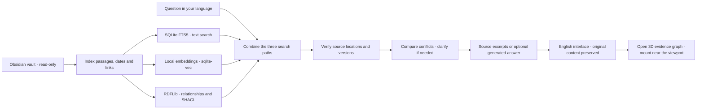

# Obsi Onto

Ask questions about your local Obsidian vault and inspect the notes, passages, and line numbers behind each answer.

Obsi Onto is a local, single-user app built with **SQLite FTS5 + sqlite-vec + RDFLib/SHACL**. It never edits your original Markdown files. An LLM is optional: source search and the knowledge graph work without an API key.

The interface is **English by default**. Notes, questions, saved answers, and source excerpts keep their original language. Generated answers follow the language of your question, with English as the fallback when the language is unclear. Interface dates and times use the English locale.

## What you can do

| Feature | Capabilities |
|---|---|
| Connect a vault | Choose a local or iCloud folder in Finder and exclude private paths |
| Search with sources | Combine text, semantic, and relationship search; inspect passages, dates, lines, and versions |
| Continue a conversation | Restore chats and use up to 20 recent turns as context for follow-up questions |
| Generate answers | Summarize or compare verified sources with sentence-level citations; fall back to excerpts on failure |
| Review conflicts | Follow actual processing stages, compare conflicting passages, and clarify or defer |
| Suggested questions | Generate up to six suggestions after vault configuration changes, with source locations and timestamps |
| Explore knowledge | Navigate a 3D map of notes, passages, tags, topics, and reviewed relationships |
| Keep the index current | Incremental file notifications with periodic metadata reconciliation |

The ontology connects explicit links, properties, and relationships you have reviewed. Similar passages are not automatically promoted to confirmed facts.

### Early preview


[Watch or download the MP4](docs/media/obsi-onto-preview.mp4). The recording uses 80 fictional notes and source search without an LLM. It shows the current development preview, including the 3D evidence route, source tiles, and themes. See the [media notes and LinkedIn drafts](docs/media/README.md).



## Quick start

### Requirements

- Tested on **macOS with Python 3.12**. Supported Python versions are 3.12–3.13. The Finder folder picker is macOS-only.
- Install Git and [uv](https://docs.astral.sh/uv/). Node.js is needed for graph development, tests, and rebuilding the bundled library, but not for running the app.
- An internet connection is needed for the initial dependency and public embedding-model downloads. API keys are optional.

### Install and run

While the implementation PRs are under review, clone the latest development preview branch:

Review the [current preview PR #2](https://github.com/espseongsm/obsi-onto/pull/2), stacked on the [initial MVP PR #1](https://github.com/espseongsm/obsi-onto/pull/1).

```sh
git clone --branch codex/initial-preview https://github.com/espseongsm/obsi-onto.git
cd obsi-onto
uv sync --locked --python 3.12
uv run main.py
```

After the implementation is merged into `main`, omit `--branch codex/initial-preview` when cloning.

[Open the local app](http://127.0.0.1:8765)

The app opens your default browser once the server is ready. If it does not open automatically, visit the HTTP address above. Opening `web/index.html` directly only shows launch instructions. Keep the terminal running while using the app.

If no vault is connected, choose **Choose in Finder**, enter a folder path, or select **Explore sample notes first**. Connect your vault to begin searching without an API key. To replace the sample vault with your own, use **Vault settings → Delete local index and history**, then connect your folder. This deletes app data, not your original notes.

Use `uv run main.py --port 8766` to change the port. Press `Ctrl+C` to stop the server and run the same command to start it again. The app does not install a login item.

### Optional: prepare `.env`

Create `.env` only when configuring model APIs or a custom data directory. These commands preserve an existing file:

```sh
cp -n .env.example .env
chmod 600 .env
```

Copying the file does not enable external API requests. Follow [LLM API key setup](#llm-api-key-setup) to configure the API address, key, model, and transmission permission. `main.py` loads the project `.env`; environment variables already set in the shell take precedence. Restart the server after changing `.env`. The file, local databases, and personal preview screenshots are excluded from Git.

## Connect your first vault

Before a vault is connected, the app shows the connection prompt, hides chat and suggestions, and disables knowledge search, the note library, and relationship review. **Vault settings** remains available. Connecting a vault does not require an LLM.

1. Choose a local or iCloud Drive folder with **Choose in Finder**, or enter its path, then click **Connect vault**. The same controls are available in **Vault settings**.
2. To apply exclusions before indexing, save the path and exclusions together in **Vault settings**. Enter one vault-relative path or pattern per line, such as `Private` or `Archive/**`. `.obsidian`, `.git`, `.trash`, and symbolic links are excluded by default. Suggested-question generation also respects exclusions.
3. Select **Prepare local search model** to download the public multilingual MiniLM model once. It computes note and question embeddings locally on the CPU. Text and explicit-relationship search are available before the model is ready.
4. Ask a question to inspect verified excerpts, recording dates, paths, line numbers, and search routes.
5. **Questions from your vault** provides up to six suggestions. Configuration changes regenerate them after indexing. Selecting one fills the question and search scope.

Only one vault can be connected at a time. Switching folders requires deleting the existing local index and history. Save any answers you want to retain before doing so.

## Use conversations and sources

- **Ask your notes / Evidence search:** choose a suggestion or enter a question. Select **Work**, **Investment**, **Personal**, or **All notes**, with an optional recording-date range. Use **Ask** or `⌘/Ctrl + Enter`. If generation is unavailable, **Find evidence** runs the same search and explains why the LLM is not being used.
- **Follow-up questions:** up to 20 completed turns from the same vault configuration provide conversational context. References to a previous topic can augment the search terms. Factual evidence is retrieved and verified again for every answer. **New chat** starts a separate conversation; **Recent chats** reopens saved conversations.
- **Read the answer first:** generated answers have citations; search-only answers show the top source excerpts. Main text appears before supporting material, using 16px type and generous line spacing. Generated answers use the question’s language; switching the interface to English does not translate saved content.
- **Inspect sources:** **Sources** is collapsed by default and shows the source count. Expand it to reveal tiles, then select a tile or citation to read the full saved passage, path, lines, date, version, search routes, and hash. Tiles use two columns, changing to one when the chat pane is 320px wide or narrower. Selecting a citation or graph node preserves the source list’s collapsed state and highlights the matching tile.
- **See the graph immediately:** each answer’s **3D evidence graph** is open by default and can be collapsed. In long conversations, graphs are mounted near the viewport and released when far off screen or collapsed. Returning restores their saved coordinates, camera, and selection. **Sources** and **Search & verification** remain collapsed by default.
- **Open the original:** **Open in Obsidian** opens the note; **View in graph** selects the corresponding evidence node. Selecting a graph node opens its graph inspector without automatically opening the source dialog.
- **Review relationships:** with generation enabled, select **Suggest relationships from these sources**, then review the original passages in **Review relationships**. Candidates enter confirmed relationship search only after approval. These controls are unavailable in search-only mode.
- **Reopen history:** recent chats load up to 50 turns with their original evidence snapshots. Saved evidence may differ from current files. Older single-question records remain readable, but records without a vault-configuration version are not automatically used as follow-up context.

### Progress and clarification

The app shows **Finding evidence → Verifying sources → Comparing conflicts → Writing answer → Rechecking sources**. When clarification is needed, it presents two passages with dates, line numbers, versions, and their graph. An orange dashed line marks a possible difference for this question.

- Choose **Use source A**, **Use source B**, **Keep both: different contexts**, or **Explain the context**, then **Confirm and continue**. The choice applies only to this answer and is stored with its clarification record.
- **Defer · use a partial source-based answer** keeps both sources without choosing a winner and returns excerpts without generated prose.
- You can respond later. Pending clarification survives page reloads and server restarts. A question interrupted while actively running is marked as interrupted and can be re-entered.
- **Cancel question** prevents late responses from being published. It does not undo a model request already sent to a provider.
- If the sources or exclusion settings change while waiting, the old choice is not reused; the app asks you to submit the question again. Original notes and the confirmed ontology are unchanged.

Without an LLM, rules compare explicit date fields sharing the same recording date. With an LLM, other semantic differences can be suggested as candidates. The process examines retrieved evidence and selected passages from those notes; it is not an exhaustive conflict scan.

If external generation is enabled, the question, retrieved and supplemental evidence, clarification, and up to 20 recent turns from the same conversation are sent to the configured API. A vault-configuration or exclusion change prevents the old conversation context from being sent on follow-up questions. See the [detailed contract](docs/answer-progress-and-clarification.md).

The agent is a Python workflow for scoped retrieval, verification, conflict review, cited generation, and persistence. It does not use LangGraph or a separate Agent SDK, and it has no autonomous tools for editing notes, browsing external websites, or placing trades.

## Explore the 3D graph

On wide screens, chat and the knowledge graph start at a **1:2** width ratio. The initial map includes every indexed, ready note and its connected topics and tags. Restoring a conversation keeps this whole-vault overview.

A new question adds its evidence to the same map. The camera visits relevant locations, then frames all the evidence used for that answer. Background nodes represent the current vault; evidence nodes preserve their answer-time snapshot. The tour is a visual exploration route, not the LLM’s reasoning order.

Switch between **Whole vault** and **Answer evidence**. A selected node shows its direct connections, source details, and corresponding source tile. **Clear** or **×** dismisses the selection. **Graph guide** explains the controls. **Knowledge search** searches names and note text independently, while each answer’s **3D evidence graph** shows its saved evidence.

Nodes have shaded spherical surfaces and distinct colors by **knowledge area**. The **Knowledge areas** legend shows the areas present in the current view and their node counts. The ten areas are **AI & Models**, **Data & Analytics**, **Software & Infra**, **Work & Projects**, **Investing & Markets**, **Economy & Policy**, **Life & Health**, **Ideas & Learning**, **Journal**, and **Uncategorized**. Selection preserves the area color and adds rings and emphasized connections. Original node types—note, passage, topic, tag, reviewed claim, or reviewed activity—remain visible in the selector and details.

Classification uses local rules on the available tags, topics, titles/names, and folders. Matching tag/topic fields contribute 8 points, title/name 5, and folder 2; the highest total determines the area. Unmatched passages and reviewed records can inherit their source note’s area. Otherwise, a dated note title or journal folder provides the Journal fallback, and unmatched records use Uncategorized. Select a node to see its area and classification reason. This is a display label: it does not scan source excerpts, call an LLM, modify notes or saved snapshots, or add relationships. Neither area colors nor spatial distances establish semantic similarity.

Node radii are **15% smaller**, including the degree-based size adjustment, to leave more room between records.

| Control | Action |
|---|---|
| Drag / arrow keys | Rotate; focus the canvas before using arrow keys |
| Wheel / `+` and `−` | Zoom |
| Right-button drag / two-finger touch | Pan |
| Node, label, or node selector | Highlight direct neighbors and inspect sources and relationships |
| ⤢ / `Home` | Reset the camera |
| ⟳ / **Labels** | Toggle rotation or node labels |
| **Clear** / `Escape` | Clear the selected node |
| **Follow evidence** | Replay the camera route through this answer’s evidence |
| **All evidence** | Fit every node used by this answer into view |
| **Stop tour** / direct camera manipulation | Stop automatic movement and explore manually |

The whole-vault map has no note-count cap. Independent knowledge search and individual answer snapshots are limited to **80 nodes and 200 links**; the combined chat map can contain more. The overview folds actual document links into note-level connections and includes connected topics and tags. It does not invent links from similarity.

Three.js and OrbitControls are bundled locally. A **WebGL 2** browser is required for 3D; the node selector and source inspector remain usable without it. Automatic rotation is off by default. Evidence tours visit up to three locations, then stop at the full evidence view. Reduced-motion preferences skip camera flights and entrance/selection effects. Hidden and off-screen scenes stop rendering; released scenes free GPU resources. Optional automatic rotation is limited to about 30fps.

### Themes and pane sizes

**Light / Dark / AI** changes the interface, source dialog, and graph together. Light uses cool whites and blue accents; Dark uses black and neutral gray with restrained blue accents; the default AI theme uses deep blue, cobalt, and cyan. Each knowledge area has a color token in all three themes, with brightness adjusted for the background. The same tokens color the nodes, labels, legend, and category badges. Theme changes preserve the camera and selection.

Drag the divider to resize chat and graph. **Reset split**, double-click, or `Home` on the focused divider restores 1:2. Use `←`/`→` for keyboard resizing and hold `Shift` for larger changes. Press `Escape` during a drag to cancel. Ratios are saved in your browser, and minimum widths keep both panes usable. At widths of 1100px or less, the graph moves below the chat while retaining your desktop preference. Resizing preserves a manually positioned camera and selected node.

Example questions: “Why did Project B change direction?”, “How has my investment thesis for Company A changed?”, and “Find analyses connected to my investment principles.” Use names found in your own notes. See the [scenario guide](docs/question-scenarios.md).

## Storage and updates

- Suggested questions are saved in SQLite after the initial connection or changes to the path, exclusions, or filename-date interpretation. An existing vault without saved suggestions receives them on the next start. Reopening the app, saving unchanged settings, changing the refresh interval, or ordinary note edits does not regenerate them.
- Suggestion generation samples one verified passage from each of up to 24 ready notes across work, investment, personal, and unclassified scopes, favoring recent recording dates within each scope. The model receives up to 120 characters each of title and heading, 600 characters of text, the recording date, and a source ID. Suggestions display timestamps and source locations. This is a sample, not a complete representation of the vault.
- Without a generation model, or after generation failure, suggestions use actual note titles. If no valid source text is available, the app shows an explanation. Disconnected vaults show onboarding instead of suggestions.
- The default data directory is `~/Library/Application Support/obsi-onto/`. Override it with `OBSI_DATA_DIR`, keeping it outside the vault and cloud-synced folders. Known iCloud/File Provider paths and paths inside the vault are rejected. Check other locations, such as cloud-synced Documents folders, yourself.
- File creation, changes, moves, and deletions trigger incremental indexing after a default **2-second** settling period. Only affected files are read.
- Metadata reconciliation runs when idle, by default every **30 minutes**. Unchanged files do not trigger content reads, embeddings, or RDF revalidation.
- Startup, resuming after a long pause, and manual refresh also reconcile metadata. A thread waits at most 30 seconds to detect resume; this does not mean a directory scan every 30 seconds, and the app does not wake a sleeping Mac.
- **Deep scan** compares content hashes and reuses unchanged embeddings. Metadata alone cannot detect a missed notification when file identity, size, and modification time all stay unchanged. Answer sources are reread and verified before use.
- Read errors, undownloaded iCloud files, and permission failures are not treated as deletions. Affected notes are excluded from current answers and retried. For iCloud folders, use **Keep Downloaded** in Finder.
- Deleting app data removes the index, answer snapshots, and relationship reviews. Original notes and public model files remain. This is not a forensic secure-erasure feature.

## How notes are interpreted

Content is split by headings and paragraphs. Titles, tags, and `domain` supply `work`, `investment`, and `personal` scopes. A passage can belong to several scopes. Search unclassified passages under **All notes**.

- Wikilinks, internal Markdown links, heading/block links, aliases, and tags are parsed. Ambiguous names are not arbitrarily merged.
- Frontmatter `topics`, `project`, `company`, and `people` become explicit topics. External URLs are stored as sources with unverified content; the app does not visit or download them.
- `date: YYYY-MM-DD`, or an enabled `YYYY-MM-DD.md` filename, supplies the **recording date**. Recording dates and modification times are not converted into event dates.
- Creating claims or activities from ordinary prose requires optional model suggestions and user review. Candidates containing subjects or quotes absent from their sources are rejected.
- Accepted candidates participate in relationship retrieval. Changing their source passage or context invalidates the review; changes elsewhere preserve reviews whose evidence can still be verified.
- Search-only mode returns excerpts. Natural-language summaries and comparisons require a generation model. Plans and considerations are not automatically treated as completed work or actual trades.
- Automatic quantity/price extraction, definitive logical contradiction detection, and inference of your current position are outside the scope. The app surfaces possible conflicts for source review.

## Search without an LLM

With no API key or an unavailable model, **Evidence search mode** still provides excerpts, citations, source tiles, and graphs. **Knowledge search** explores notes, tags, topics, and explicit or reviewed relationships. Model configuration does not block vault connection or search.

| Capability | LLM unavailable | LLM available |
|---|---|---|
| Source search, tiles, citations, evidence graphs | Available | Available |
| Knowledge search and explicit relationships | Available | Available |
| Semantic search | After preparing the separate local embedding model | Same |
| Generated summaries, comparisons, relationship suggestions | Unavailable | Generated from verified evidence |
| Relationship review menu | Disabled | Available |
| Suggested questions | Based on note titles | Model-generated if sampling permission is also enabled |

Text search and explicit-relationship search need neither a generation API key nor an embedding-model download. Local semantic search is independent of the LLM. Rule-based comparisons of explicit date fields with the same recording date remain available without a model.

### LLM API key setup

1. Stop a running server with `Ctrl+C`. From the project directory, prepare `.env` without overwriting an existing file:

   ```sh
   cp -n .env.example .env
   chmod 600 .env
   open -e .env
   ```

2. Edit the **existing lines** for these variables. Replace the example address, key, and model ID with values from your provider; do not append duplicate definitions:

   ```dotenv
   OBSI_LLM_URL=https://your-provider.example/v1
   OBSI_LLM_API_KEY=replace-with-your-api-key
   OBSI_LLM_MODEL=your-provider-model-id
   OBSI_ALLOW_EXTERNAL_GENERATION=1
   OBSI_ALLOW_EXTERNAL_SUGGESTIONS=0
   ```

   The API must support `/chat/completions` and JSON responses. Set `OBSI_LLM_URL` to the provider’s **API base URL**, without `/chat/completions`; the app appends that path. Use a model ID actually available to your account and endpoint. A model named in `.env.example` is not guaranteed to exist at every provider.

3. Save the file and restart with `uv run main.py`. Check the generation status in **Vault settings**. A configured status is not a live provider test. Authentication or connection failures during use switch the app to source search.

`.env.example` references `OPENAI_BASE_URL` and `OPENAI_API_KEY` through `OBSI_LLM_URL=${OPENAI_BASE_URL}` and `OBSI_LLM_API_KEY=${OPENAI_API_KEY}`. You can enter values directly in `OBSI_LLM_*`, as above, or keep those references and fill in `OPENAI_*`. Shell-only `OPENAI_*` variables are not automatically connected if those reference lines are removed. Shell variables with the same name take precedence over `.env`.

`OBSI_ALLOW_EXTERNAL_GENERATION=1` permits sending the current question, retrieved and supplemental evidence, clarification, and up to 20 recent conversation turns to the configured API. **Automatic external suggested-question generation requires separate permission.** Set `OBSI_ALLOW_EXTERNAL_SUGGESTIONS=1` only if sending the sampled note content to that API is acceptable, then restart. The default `0` uses note-title suggestions. Embeddings stay local unless configured separately.

### Local generation models

An already installed local server can be used if it supports an OpenAI-compatible `/chat/completions` JSON API. Include `/v1` in the base address when required by that server. For example, if it serves the chosen model:

```sh
OBSI_LLM_URL=http://127.0.0.1:11434/v1 \
OBSI_LLM_MODEL=your-installed-model \
OBSI_LLM_API_KEY= \
uv run main.py
```

Servers at `localhost`, `127.0.0.1`, or `::1` can run without a key or external-transmission permission. Set a key if your local server requires authentication.

| Variable | Purpose |
|---|---|
| `OBSI_LLM_URL` | HTTPS API base URL for external providers, including `/v1` where required |
| `OBSI_LLM_MODEL` | Generation model ID |
| `OBSI_LLM_API_KEY` | Authentication key read only by the server |
| `OBSI_ALLOW_EXTERNAL_GENERATION=1` | Permit external transmission of questions and selected evidence |
| `OBSI_ALLOW_EXTERNAL_SUGGESTIONS=1` | Permit note sampling for automatic suggested questions; off by default |

Keep keys in the ignored `.env` or process environment, not browser fields, documentation, or commits. Missing configuration, invalid URLs, missing external keys, or unapproved external transmission start the app in search-only mode with an explanation.

Authentication, network, HTTP, and unreadable-JSON failures return verified source evidence and disable further generation calls until the server restarts. Check the configuration or provider, then restart to retry. If valid JSON fails answer or citation validation, only that answer falls back to excerpts. Valid citation IDs do not by themselves guarantee semantic correctness.

## Optional external embeddings

The default model is `sentence-transformers/paraphrase-multilingual-MiniLM-L12-v2`: 384 dimensions, running locally through FastEmbed ONNX on the CPU. Cache keys include the public model files’ SHA-256, model ID, FastEmbed version, input rules, and dimensions.

External embeddings are configured **separately** from generation. They send changed passages being indexed and search questions to the selected API.

| Variable | Purpose |
|---|---|
| `OBSI_EMBEDDING=external` | Select the external embedding adapter |
| `OBSI_EMBED_URL` | HTTPS API base URL, including `/v1` where required |
| `OBSI_EMBED_MODEL` | Embedding model ID, preferably a fixed version |
| `OBSI_EMBED_DIM` | The model’s actual vector dimensions |
| `OBSI_EMBED_API_KEY` | Server authentication key |
| `OBSI_ALLOW_EXTERNAL_EMBEDDING=1` | Permit external transmission for indexing and queries |

Changing the model or dimensions rebuilds vectors. During this process, only vectors ready for the new model are searched; text search remains available. A provider changing its implementation under the same model ID cannot be detected, so prefer versioned IDs.

## Data locations and operation

| Item | Default or setting |
|---|---|
| App address | `http://127.0.0.1:8765`; override with `--port` |
| Vault | Your selected Markdown folder; originals are read-only |
| App data | `~/Library/Application Support/obsi-onto/`; override with `OBSI_DATA_DIR` |
| SQLite and chat history | `index.sqlite3` and related files in the app data directory |
| File settling delay | 2 seconds; configurable in Vault settings |
| Metadata reconciliation | 30 minutes; configurable in Vault settings |

For example, set `OBSI_DATA_DIR=/Users/your-name/Library/Application Support/obsi-onto` in `.env`. Existing data is not moved automatically. Only one app process may use a data directory at a time. Do not use a temporary directory such as `/tmp` for data you want to retain.

Closing the browser leaves file watching active while the backend runs. Stopping the server stops watching; the next start reconciles changes. This remains a local, single-user deployment on a computer you control. An English interface does not add a public internet server or multi-user hosting mode.

## API and input limits

The browser obtains a token from `GET /api/session` and sends it in the **`X-Obsi-Token` header for every other API**. Tokens are not placed in URLs. Requests with external website origins are rejected.

| API | Behavior |
|---|---|
| `POST /api/query-jobs` | Submit a question, filters, and unique `request_id`; returns 202 and a job ID |
| `GET /api/query-jobs` | List active questions and pending clarifications |
| `GET /api/query-jobs/{id}?after={seq}` | Return job state, or a lightweight `unchanged` response at the same event sequence |
| `GET /api/query-jobs/{id}/events` | SSE events after `Last-Event-ID`; use a client that can send the token header |
| `POST /api/query-jobs/{id}/clarifications` | Submit `question_id`, `version`, unique `request_id`, `choice`, and `explanation` |
| `POST /api/query-jobs/{id}/cancel` | Cancel a question |
| `POST /api/ask` | Compatibility API using the same runner; returns 200 on completion or 202 while awaiting clarification |
| `GET /api/graph?overview=true` | All ready notes and their connected topics/tags in a note-level overview |
| `GET /api/graph?q=...` | Bounded detailed graph search |

Questions are limited to 3,000 characters, clarification to 2,000 characters, and mutation request bodies to 64KiB. Notes are limited to 8MiB, a line to 16,384 characters, and frontmatter to 64KiB, depth 20, and 4,000 nodes. YAML aliases are unsupported. Indexing errors explain exceeded limits. Special files and symlinks are not read. New data directories use owner-only `0700`; database and lock files use `0600`.

There are two workers and at most eight active or awaiting-clarification jobs. Each job retains its latest 64 events; terminal jobs are pruned within the latest 100 jobs while final answer history remains. **Delete local index and history** also removes jobs, events, and clarifications. Schema upgrades add job tables and vector-retry columns automatically; stop the old server before restarting an updated version.

## Troubleshooting

| Symptom | What to check |
|---|---|
| The page does not open | Confirm `uv run main.py` is running, then open the local address printed in the terminal. |
| The port is occupied | Stop the old server or use another port, such as `--port 8766`. Two servers cannot share one data directory. |
| iCloud notes are pending or in error | Download them in Finder, check read permissions, and use **Notes & index → Refresh now**. |
| Changes do not appear in search | Wait for indexing. If the issue persists, run **Deep scan** to compare content hashes. |
| A question returns no evidence | Use names found in your notes and broaden the scope or date range. Search unclassified notes under **All notes** and undated notes without date filters. |
| Semantic search is not ready | Select **Vault settings → Prepare local search model**. The initial download needs internet access. |
| Connection onboarding appears first | Connect a vault with Finder or a folder path. No API key is needed. |
| The app is in Evidence search mode | Read the reason in settings. Search and graphs remain available. To enable generation, follow [LLM API key setup](#llm-api-key-setup) and restart. |
| Model calls fail during use | Check the key, permissions, model ID, base URL, connection, and JSON-response support, then restart. Transport/unreadable-response failures disable generation until restart; citation/content validation failures affect only that answer. |
| `.env` changes have no effect | Restart the server. Same-named shell environment variables override `.env`. |
| Opening HTML shows launch instructions | Run the server and use its HTTP address. File URLs cannot access the API or server static paths. |
| Suggestions only use note titles | This is the fallback without a usable model or permission. Content-based external suggestions require `OBSI_ALLOW_EXTERNAL_SUGGESTIONS=1`. |
| Suggestions stay the same after saving notes | They regenerate after vault connection, exclusion, or date-interpretation changes, not after every file save. |
| Old notes or answers still appear in another language | The English interface preserves original user content and stored snapshots. Ask new questions in your preferred answer language. |

## Development and validation

```sh
uv run ruff check .
uv run ruff format --check .
uv run pytest -q
node --check web/app.js
node --check web/scenarios.js
node --check web/query-jobs.js
node --check web/graph.js
node --check web/graph-layout.js
node --check web/graph-categories.js
node --check web/graph-flight.js
node --check web/graph-scene.js
node --test tests/*.test.cjs
```

Automated tests use temporary fictional vaults and model doubles, including a macOS file-watcher check. Restricted environments may block operating-system notifications. These tests do not measure the factual accuracy of a live model’s answers. Graph tests cover layout, focus, camera framing, and question/overview coordination.

Rebuild the bundled Three.js library only when needed:

```sh
npm ci --ignore-scripts --no-audit --no-fund
npm run build:graph
```

To rerun retrieval evaluation, prepare the local embedding model and execute `uv run python scripts/evaluate.py`. This script does not automatically load `.env`; pass the same `OBSI_DATA_DIR` in the shell if using a custom location. It uses five fictional notes and 20 Korean questions in a temporary database, leaving your real vault unchanged. Results are saved in `docs/evaluation.json`.

- [Retrieval evaluation](docs/evaluation.md)
- [Architecture and processing flow](docs/architecture.md)
- [Question scenarios and graph usage](docs/question-scenarios.md)
- [PRD and implementation status](prd.md)
- [Development log](daily-development-report.md)

The linked project documents are maintained in Korean. Evaluation currently uses small synthetic development data; real-vault recall, large-scale performance, iCloud latency/resume behavior, and live generation quality require separate measurement.

## Project layout

```text
main.py                 Local server entry point
app/api.py              API and local access boundaries
app/folder_picker.py    macOS folder picker
app/service.py          Work queue, file watching, retries
app/files.py            Metadata enumeration and safe source reads
app/markdown.py         Passage, link, property, and source-location parsing
app/indexer.py          Incremental indexing, vector cache, source versions
app/storage.py          SQLite, FTS5, sqlite-vec, answer snapshots
app/ontology.py         Explicit relations, RDF, SHACL, allowed queries
app/graph_view.py       Bounded detailed search and answer graph snapshots
app/graph_overview.py   Complete ready-note overview with topics and tags
app/search.py           Search planning, ranking, citation verification
app/models.py           Local embeddings and optional generation API
app/query_jobs.py       Job states, model calls, clarification, cancellation
app/job_store.py        Persistent jobs, ordered events, recovery
app/job_api.py          Question, clarification, and SSE API
app/query_contracts.py  Input and model-output contracts
app/answers.py         Evidence snapshots, revalidation, answer publication
app/conflicts.py        Source-based conflict candidates and temporary graph links
app/frontmatter.py     Bounded YAML parsing
app/suggestions.py     Vault sampling and saved question suggestions
ontology/              RDF schema and SHACL constraints
web/                   Local interface without an external CDN
web/ui-text.js         English presentation of known system messages
web/chat-split.js      Pane resizing, saved ratio, keyboard controls
web/chat-graph.js      Whole-vault/evidence composition and tour state
web/graph.js           Shared graph UI, source inspector, viewport lifecycle
web/graph-layout.js    Deterministic 3D layout and coordinate restoration
web/graph-categories.js Display-only knowledge areas from names and explicit metadata
web/graph-flight.js    Camera framing, interpolation, tour stops
web/graph-scene.js     Three.js rendering, camera, highlights, GPU cleanup
web/vendor/           Local Three.js bundle and MIT license
scripts/build-graph.mjs Rebuild the bundle from locked npm dependencies
examples/vault/        Fictional work, investment, and personal notes
tests/                 Behavior, provenance, update, API, and watcher tests
```
