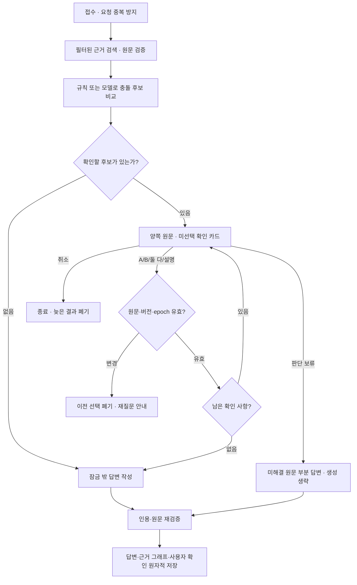

# 답변 진행 표시와 능동적 충돌 확인

2026-09-28 · 첫 구현 완료 · Python 상태 머신, 별도 Agent SDK/LangGraph 없음

사용자 요구: “llm이 답변을 생성하면서 생각하는 단계를 보여주고 데이터간의 충돌을 찾아서 적극적으로 사용자에게 물어보는 기능이 필요해.”

## 1. 실제 처리 과정

상태는 `queued → retrieving → verifying → checking_conflicts → awaiting_user / generating → finalizing → completed`다. 취소·실패·중단·근거 변경은 `cancelled / failed / interrupted / stale`로 구분한다. 재개는 queued/verifying부터 진행한다.

화면은 단계 메시지, 시각, 실제 후보·검증 수와 경과 시간을 보여준다. 내부 추론 원문, 숨겨진 프롬프트, 가상 퍼센트는 표시하지 않는다. 완료된 진행 목록은 접고 답변과 확인 사항을 남긴다. 생성 중 텍스트 토큰 스트리밍은 제공하지 않는다.

## 2. 충돌 탐지 범위

- 기존 검색 결과 최대 12개에 **같은 노트에서 추가 문단 최대 12개**를 보충한다. domain/date/ready/revision/excludes 범위를 유지하고 원문을 다시 확인한다. 반대 주장 전용 검색이나 전체 볼트의 모든 쌍 비교는 구현하지 않았다.
- 규칙은 **같은 알려진 기록일**의 명시 필드 `<대상> 출시일|마감일|확정일: YYYY-MM-DD`를 비교한다. 서로 다른 유효 날짜가 별도 출처에 있으면 `needs_context` 후보를 만든다. 서로 다른 기록일은 이 규칙으로 충돌로 판정하지 않는다.
- 규칙 후보가 없고 생성 모델이 켜져 있으며 근거가 둘 이상이면 의미적 충돌 점검을 한 번 요청한다. 프롬프트는 대상·시점·조건·단위·계획/실행·인용 주체 구분을 요구한다. 실제 모델의 정밀도/재현율은 아직 측정하지 않았다.
- 모델 후보는 Pydantic으로 구조/길이를 검증한다. 두 citation이 다르고 정확한 인용문이 해당 원문에 존재하며 대상이 양쪽에 있어야 한다. 같은 출처 쌍의 중복은 버리고 최대 3개 쟁점을 순서대로 묻는다. 구조 검증이 의미적 충돌의 진실성을 보증하지 않는다.
- 모델 미사용/점검 실패를 “충돌 없음”으로 바꾸지 않는다. 규칙만 비교했거나 의미 점검이 실패한 범위를 알린다. 최신 수정 시각·검색 순위로 한쪽을 정답으로 고르지 않는다.

## 3. 확인 화면과 이력

양쪽 원문 인용, 경로, 줄, revision, 기록일과 Obsidian 원문 링크를 보여준다. 사건일·조건을 별도 구조화해 표시하는 기능은 아직 없으며 기록일을 사건일로 바꾸지 않는다.

| 동작 | 결과 |
|---|---|
| A / B 기록 기준 | 선택을 별도 맥락으로 모델에 전달 |
| 서로 다른 맥락이므로 둘 다 유지 | 양쪽 근거와 선택을 유지 |
| 직접 설명 | 최대 2,000자 필수 입력 |
| 판단 보류 · 원문으로 부분 답변 | 남은 쟁점도 deferred, 모델 생성 없이 원문 함께 표시 |
| 질문 취소 | 취소 상태 저장, 이후 도착한 답변 게시 차단 |
| 나중에 응답 | 대기 상태를 저장, 접속 종료·시간 경과로 자동 승인하지 않음 |

선택지는 기본 미선택이다. 확인은 `user_clarification`, `scope=this_answer`로 기록하며 답변의 **사용자 확인 · 이번 답변의 기준**에 표시한다. 생성 모델이 꺼져 있으면 선택 이력과 원문을 함께 표시한다. 원본 Markdown과 확정 RDF는 수정하지 않는다. 다른 질문에서 재사용하는 확인 규칙, 저장된 개별 선택의 취소는 후속 기능이다.

3D 그래프는 양쪽 근거에 주황 강조와 점선 연결을 표시한다. 이 선은 질문의 임시 오버레이이며 확정 온톨로지 관계가 아니다. 답변 이력은 당시 근거·확인·보류 상태를 보존한다. 과거 이력을 열면 현재 작업의 화면 추적을 멈추지만 서버 작업 자체를 취소하지는 않는다.

## 4. API·저장·복구 계약

| 경로 | 역할 |
|---|---|
| `POST /api/query-jobs` | 엄격한 입력·고유 request_id 검사, 202 + 작업 ID |
| `GET /api/query-jobs` | 진행·확인 대기 목록, 최대 8개 |
| `GET /api/query-jobs/{id}?after={seq}` | 상태·증가하는 seq·최근 이벤트·확인·근거·결과. 번호가 같으면 unchanged |
| `GET /api/query-jobs/{id}/events` | Last-Event-ID 이후 SSE. 최대 8개 스트림, 연결당 30초, 대기/종료 때 닫힘 |
| `POST /api/query-jobs/{id}/clarifications` | question_id·version·request_id·choice·explanation, 한 번만 적용 |
| `POST /api/query-jobs/{id}/cancel` | 취소 상태, 늦은 결과 폐기 |
| `POST /api/ask` | 같은 실행기 호환 경로. 완료 200, 사용자 확인 대기 202 |

UI는 750ms 조건부 조회를 사용하고 페이지 숨김·확인 대기·종료 때 멈춘다. SSE API는 헤더 토큰을 보낼 수 있는 fetch 등으로 별도 사용할 수 있다. 브라우저 기본 EventSource용 토큰 URL은 제공하지 않는다. `/api/session` 외의 API는 GET도 `X-Obsi-Token`이 필요하다.

`query_jobs`는 요청·근거·후보·확인 내용을 저장하고 `query_events`는 job_id/seq/상태/메시지/시각/관측 수를 저장한다. 이벤트에는 API 키·프롬프트·내부 추론이 없다. 작업별 최근 64개 이벤트, 최근 100개 작업 범위의 종료 이력을 남기며 대기 작업은 지우지 않는다. 최종 답변은 기존 `runs`에 별도로 유지한다. 전체 데이터 삭제 시 새 테이블도 지운다.

워커는 2개, 진행·확인 대기는 최대 8개다. 모델 호출 세마포어도 2개이며 예상 질문은 같은 워커 풀에 하나만 예약한다. 모델/사용자 대기 중 operation 잠금이나 DB 트랜잭션을 유지하지 않는다. 이미 시작한 외부 HTTP 요청의 전송 자체를 취소하는 기능은 아니며 결과 게시를 막는다.

서버 재시작 시 awaiting_user는 그대로 복구하고 실행 중이던 작업은 interrupted로 남긴다. 응답과 최종 게시 전에 원문 hash/revision·제외 설정·epoch를 다시 확인한다. 확인에 사용한 근거가 바뀌면 선택을 폐기하고 stale로 종료하며 사용자가 다시 질문하도록 안내한다. 자동 재검색 루프는 없다. 다른 노트만 변경됐으면 유효한 근거로 계속한다. 파일과 SQLite 사이 완전한 원자성 대신 최종 확인 시점을 기록한다.

## 5. 모델·보안 범위

질문 한 건에서 의미적 충돌 요청 최대 1회, 답변 생성 최대 1회다. 규칙 후보가 있으면 모델 충돌 요청을 생략한다. 확인 응답 자체는 모델을 부르지 않고 마지막 확인 후 한 번 생성한다. 보류는 생성을 생략한다. 같은 request_id의 응답 재전송은 중복 적용하지 않는다.

외부 모델 사용은 기존 `OBSI_ALLOW_EXTERNAL_GENERATION`을 따른다. 질문·검증된 검색/보충 근거·사용자 확인 맥락이 설정한 API에 전달된다. 예상 질문의 자동 전송은 별도 `OBSI_ALLOW_EXTERNAL_SUGGESTIONS`를 유지한다. 모델 요청 JSON은 256,000bytes, 반환 content는 100,000자로 제한하고 응답 스키마/인용을 검증한다. 이 반환 제한은 HTTP 응답 전체의 스트리밍 수신 제한은 아니다.

API 변경 요청 64KiB, 질문 3,000자, 설명 2,000자, 노트 8MiB·한 줄 16,384자, frontmatter 64KiB·깊이 20·노드 4,000개 한도를 적용한다. YAML alias와 특수 파일/symlink를 거부한다. 상세 파일 입력 경계는 `app/files.py`, `app/frontmatter.py`에 있다.

## 6. 검증과 남은 범위

Python 76개, 그래프 Node 5개가 통과했다. 작업 순서·중복 제출·확인 후 재개·보류·재시작, 느린 모델 중 색인/취소/삭제/제외/원문 변경, 잘못된 후보/인용, SSE 재전송, SQL 필터·SPARQL 결과 동등성과 벡터 복구를 검사했다. 브라우저 가상 볼트로 확인 대기 → 새로고침 → 선택 → 답변 완료 → 이력 보존을 확인했다.

실제 사용자 볼트·실제 LLM의 의미 충돌 정밀도/재현율, 투자 계획/실행·단위·시점 구분의 품질 평가는 별도다. 전체 RDF/SHACL은 유지하며 Rust 도입·증분 검증·재사용 가능한 확인 규칙·반대 주장 전용 추가 검색은 구현하지 않았다. 현재 범위와 전후 성능은 [리팩토링 구현 결과](refactor-implementation.md)를 참고한다.
