# 구현 구조와 흐름

## 앱 열기

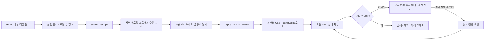

HTML은 `lang="en"`이며 기본 상태는 영어 실행 안내이고 앱 UI는 숨겨져 있습니다. `main.py`는 서버 수신이 시작된 뒤 기본 브라우저에 실제 포트의 HTTP 주소를 엽니다. 서버 시작에 실패하면 브라우저를 열지 않습니다. 서버에서 스크립트를 정상 로드하면 `app.js`가 안내를 숨기고 앱을 표시합니다. 파일 직접 열기를 위해 로컬 API의 Origin 검사나 CSP를 완화하지 않습니다.

볼트 미연결 상태에서는 **Which vault would you like to connect?** 안내를 우선 표시하고 질문 입력·예상 질문·이전 대화를 숨깁니다. 노트·지식 검색·관계 검토 진입은 비활성화하고 설정은 유지합니다. Finder 또는 직접 경로 입력으로 연결하거나 가상 샘플로 시작할 수 있습니다. 연결을 해제하면 이 상태로 돌아가며 LLM 준비 여부로 연결을 막지 않습니다.

## 구성

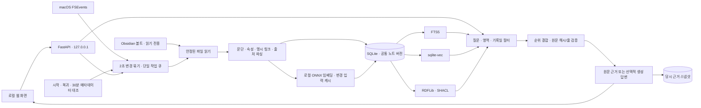

## 갱신의 공개 경계

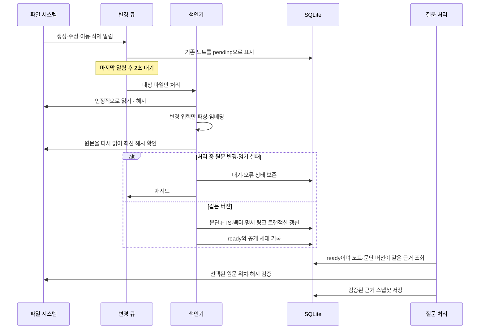

색인과 모델 준비는 기존 단일 작업 큐를 사용합니다. 질문·예상 질문은 별도 2개 워커를 사용하며 근거 확보/게시 때만 공통 operation 잠금을 잡습니다. 질문 임베딩·생성 요청과 사용자 응답 대기 중에는 잠금을 유지하지 않습니다. 색인 자체의 파싱·임베딩 구간은 아직 operation 안에서 실행하므로 긴 색인이 짧은 읽기를 지연시킬 수 있습니다. OS 이벤트는 별도로 기록하므로 처리 중 발생한 변경도 다시 큐에 남습니다. 같은 데이터 폴더를 두 프로세스가 동시에 사용하는 것은 파일 잠금으로 막습니다.

## 의미 관계와 근거

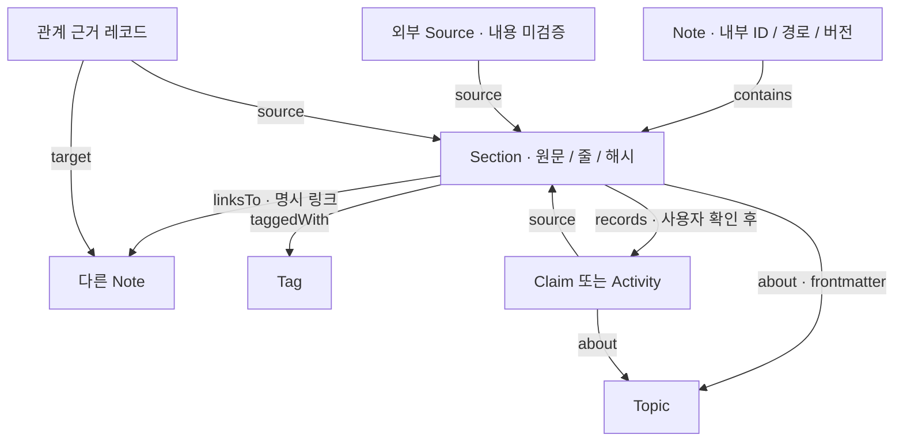

- RDF는 SQLite에서 투영하며 독립적인 최신 상태를 갖지 않습니다. 공개 세대가 같으면 검증한 그래프를 재사용합니다.
- 외부 URL·문서 간 링크·동일 주제라는 이유만으로 인과 관계나 `citesAsEvidence`를 만들지 않습니다.
- LLM 후보는 확인 전 그래프에 넣지 않습니다. 명시적 `revises`/`citesAsEvidence`의 범용 매핑은 후속 확장입니다.
- SHACL은 출처·타입·관계 구조를 확인합니다. 주장 내용의 진실 여부를 확인하는 도구는 아닙니다.

## 현재의 검색 선택

FTS5는 단어 및 한글 2글자 조각을 검색합니다. sqlite-vec는 범위가 맞는 현재 모델 벡터의 코사인 거리를 계산합니다. 정확 검색 결과의 순위, 의미 검색 순위, 실제 관계 경로의 순위를 각각 가중 RRF로 결합합니다. 점수와 거리를 직접 더하지 않습니다. 제목만 있는 문단이나 frontmatter 자체는 최종 답변 발췌에서 제외합니다.

기본 순위 가중치는 단어 1, 의미 0.5, 관계 0.15입니다. 작은 가상 개발 표본에서 보정한 값이며 일반적인 최적값이 아닙니다. 관계만 많이 연결된 문서가 질문과 직접 관련된 문단을 밀어내는 문제를 줄이려는 초기값입니다.

현재 벡터 검색은 정확 거리 비교 방식이므로 노트가 커질수록 비용도 증가합니다. 사용자 볼트에서 성능 측정 전까지 대규모 처리 성능을 보장하지 않습니다.

## 그래프 화면과 답변의 연결

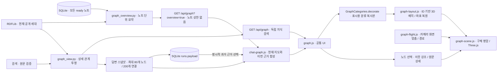

- `graph_view.py`는 RDF의 문서 구조·명시 관계·검토 관계를 보여줍니다. 벡터 간 거리로 새 관계를 생성하지 않습니다. 원문을 찾은 검색 경로는 별도 노드 속성으로 표시합니다.
- 질문 스냅샷은 검증한 근거 문단과 연결된 노트·주제·태그·판단/활동으로 제한합니다. 다른 영역/기간의 문단을 근거에 확장하지 않으며 과거 답변 그래프를 현재 RDF로 재구성하지 않습니다. 채팅 옆에 함께 표시하는 현재 볼트의 다른 노트는 `context_only` 배경으로 구분합니다. 같은 노드 ID는 스냅샷을 우선하며, 경로·버전이 다른 현재 노드의 연결을 해당 과거 근거에 붙이지 않습니다.
- `/api/graph?overview=true`는 `graph_overview.py`에서 모든 `ready` 노트와 연결된 Topic/Tag를 노트 단위로 요약합니다. 문단·검토 기록의 주제/태그는 소유 노트에 연결하고, 실제 명시 내부 링크만 소유 노트 사이로 투영합니다. 문서 포함 구조나 유사도만으로 노트 사이의 연결을 만들지 않습니다. 응답은 `scope: overview`, `projection: notes`, 공개 세대 `generation`, `limit: null`이며 노트 수 상한이 없습니다.
- 독립적인 `/api/graph` 상세 검색과 답변 스냅샷은 최대 80개 노드·200개 연결을 유지합니다. 이 상세 제한은 초기 전체 지도와 채팅의 합성 화면에 적용하지 않습니다. 모든 보기는 공통 3D 렌더러를 사용하며 노드 선택·회전·확대·이동에는 서버 및 모델 호출이 없습니다. 입체 배치 거리는 의미 유사도나 중요도를 나타내지 않습니다.
- `graph-layout.js`는 노드 ID 해시 순서로 초기 좌표를 정해 경로순 데이터가 층으로 쌓이는 현상을 줄이고 x·y·z의 입체 배치를 유지합니다. `GraphScene.capture()`의 좌표·카메라·시선 중심은 `viewState`로 복원하며 신규 문단은 포함 관계나 같은 경로의 노트 주변에 배치합니다. `graph-flight.js`의 `GraphFlight`는 화면 맞춤, 곡선 카메라 보간, 최대 세 곳의 방문 지점을 계산합니다.
- `graph-scene.js`는 OrbitControls와 로컬 Three.js 번들을 사용합니다. 격자 없이 지식 분야별 고채도 색의 구체와 실제 관계의 곡선을 그립니다. 구체 재질과 방향광의 표면 명암, 깊이별 겹침으로 입체감을 보여줍니다. **Knowledge areas** 범례는 현재 보이는 분야명과 노드 수를 표시합니다. 구체·라벨·상세 배지는 같은 분야 색을 사용하고 검색·선택 중에도 이 색을 유지합니다. 노드의 원래 종류는 선택 목록과 상세의 별도 표시로 보존합니다. 검색·선택 강조는 링·라벨·연결 경로로 구분합니다. 색은 이름과 명시 메타데이터로 정한 화면 분류이며 확정된 의미 유사도를 나타내지 않습니다. 노드 반지름은 종류별 기본 크기와 연결 수 가산을 합친 최종 값에 `0.85`를 곱해 15% 줄입니다. 1,050ms의 진입 효과와 새 노드 선택 후 900ms의 연결 빛·파동 효과 뒤에는 정지하며, 자동 회전은 사용자 선택으로 켜고 약 30fps로 제한합니다. 동작 줄이기 설정에서는 카메라 비행과 진입·선택 효과를 생략하고 화면 밖·다른 메뉴·숨겨진 탭에서는 렌더링을 중지합니다. 교체·삭제·페이지 종료 때 관찰자, 애니메이션, WebGL 자원을 정리합니다. WebGL을 열 수 없으면 선택 목록과 출처 패널을 제공합니다. 곡선과 빛의 이동은 표시 효과이며 새로운 관계·유사도·정보 흐름을 뜻하지 않습니다. 카메라 탐색 경로 역시 LLM의 추론 순서를 뜻하지 않습니다.
- `scripts/build-graph.mjs`는 잠금 파일의 Three.js 0.180.0을 `web/vendor/three-graph.min.js`로 번들링합니다. 런타임 CDN과 Node 서버는 사용하지 않습니다. MIT 라이선스는 번들 옆에 보관합니다.
- 현재 그래프 조회는 색인 게시와 동일한 작업/저장소 잠금 범위에서 수행합니다. 갱신 대기 상태인 대상 노트를 향한 명시 링크도 RDF 공개에서 제외해 잘못된 관계와 SHACL 실패를 막습니다.

### 화면용 지식 분야 분류

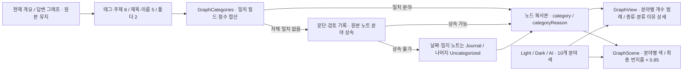

- `web/graph-categories.js`의 `GraphCategories.items`는 `ai`(AI & Models), `data`(Data & Analytics), `engineering`(Software & Infra), `work`(Work & Projects), `investing`(Investing & Markets), `economy`(Economy & Policy), `life`(Life & Health), `knowledge`(Ideas & Learning), `journal`(Journal), `other`(Uncategorized)를 정의합니다.
- `decorate(data)`는 `taggedWith`·`about`의 명시 메타데이터, 노드 이름, 폴더를 사용합니다. 일치한 태그/주제 필드마다 8점, 제목/이름 5점, 폴더 2점을 합산하고 최고 점수의 분야를 택합니다. 문단에 연결된 명시 메타데이터는 같은 경로의 소유 노트에도 반영합니다. 직접 일치가 없는 문단·검토 기록은 같은 경로 또는 `contains`/`records` 부모를 통해 분야를 상속합니다. 상속도 없으면 날짜·일지 노트의 Journal 규칙과 Uncategorized 기본값을 적용합니다.
- 이 처리는 브라우저의 표시용 복사본에만 `category`와 `categoryReason`을 추가합니다. 원문 발췌 스캔, LLM 요청, 노트·저장 스냅샷·관계 변경은 없습니다. `GraphView.mount()`는 분류 후 장면을 만들고 범례에는 실제 등장한 분야만 표시합니다. 선택 상세에는 분야 배지, 원래 종류, 분류를 결정한 이름·태그·주제·폴더 또는 상속 이유를 함께 표시합니다.

## Finder 폴더 선택

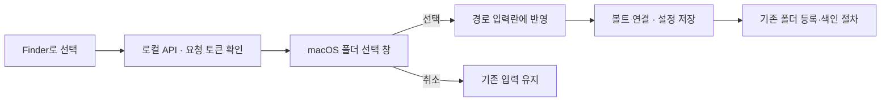

`folder_picker.py`는 고정 AppleScript와 별도 경로 인자로 폴더 선택 창을 엽니다. 폴더 선택 중에는 색인 작업 잠금을 점유하지 않으며 창 하나만 허용합니다. 폴더를 고르는 동작 자체는 볼트 연결을 변경하거나 노트를 색인하지 않습니다.

## 생성 모델 상태와 근거 검색 모드

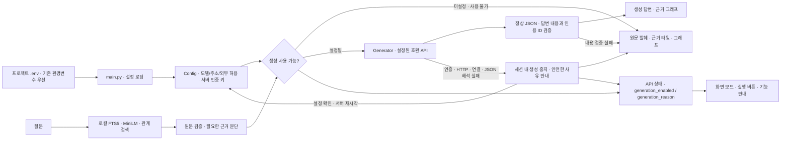

`main.py`는 `.env`를 읽되 같은 이름의 실행 환경변수를 덮어쓰지 않습니다. 인증 키는 서버에서만 읽고 상태 응답에 넣지 않습니다. 설정된 원격 API에는 질문·선택한 근거·이번 사용자 확인·제한된 대화 문맥을 보내며, 외부 생성은 별도 허용이 필요합니다. 예상 질문 표본 전송과 외부 임베딩은 각각 독립적으로 허용합니다. loopback 주소의 로컬 생성 서버는 키 없는 구성을 허용합니다.

URL·모델·원격 키 누락, 잘못된 주소, 전송 미허용은 서버 시작을 막지 않고 `generation_enabled=false`와 안전한 `generation_reason`으로 알립니다. 실제 생성 API의 인증·HTTP·연결 실패 또는 읽을 수 없는 JSON 응답이 확인되면 해당 서버 세션에서 생성을 중지하고 원문 검색을 유지합니다. 상태 조회에 건강 확인용 모델 요청을 보내거나 자동 재시도하지 않으며 설정 확인 후 서버를 재시작해 복구합니다. 정상 JSON을 받은 뒤 답변 내용·인용 검증에 실패한 경우에는 생성 서비스를 모두 끄지 않고 해당 답변만 원문으로 돌립니다.

생성 비활성 화면은 **근거 검색 / 근거 찾기**와 사유를 표시합니다. 근거 타일·출처·명시 관계·지식 검색·노트 목록·볼트 설정을 유지하고 모델 요약·의미 관계 후보 생성은 제공하지 않습니다. 후보 제안 버튼을 숨기고 관계 검토 메뉴를 비활성화합니다. 같은 기록일의 명시 날짜 비교는 규칙으로 유지합니다. 로컬 MiniLM 준비는 생성 모델과 별개이며 준비 전에도 단어·명시 관계 검색을 사용할 수 있습니다. 인용 ID 검증은 답변 내용의 의미적 정확성을 보장하지 않습니다.

## 볼트 설정 변경과 예상 질문

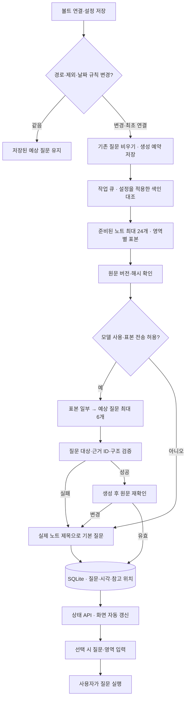

`app/suggestions.py`가 기존 검색의 문단 필터·원문 검증과 생성 API를 재사용합니다. 모델 전송은 노트당 제목·문단 제목 각 120자와 본문 600자 이내, 기록일·근거 ID로 제한합니다. 표본의 원문은 새 질문 캐시에 복제하지 않습니다. 제외 설정이 바뀌면 이전 질문을 바로 숨기며, 일반 노트 변경 때는 질문을 자동 재생성하지 않습니다. 모델 호출 실패는 기본 질문으로 복귀하고 화면 조회 때마다 재시도하지 않습니다.

외부 모델의 예상 질문 생성은 `OBSI_ALLOW_EXTERNAL_SUGGESTIONS`로 별도 제어합니다. 꺼져 있으면 기존 답변 모델 연결을 유지하면서 예상 질문만 로컬 기본 질문으로 처리합니다. 이 허용을 켜고 재시작하면 저장된 기본 질문을 한 번 갱신합니다.

## 질문 작업과 사용자 확인 (2026-09-28 구현)

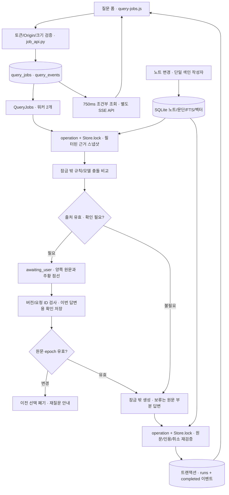

- `main.py → create_app → Service → QueryJobs`로 시작한다. `Search.ask`와 `/api/ask`도 같은 작업 실행기를 사용한다. 별도 Agent SDK/LangGraph는 없다.
- `operation → Store.lock → 짧은 transaction` 순서를 유지한다. SSE는 동기 DB 조회를 `asyncio.to_thread`로 실행하며 await를 RLock 안에서 유지하지 않는다. 중첩 트랜잭션은 SAVEPOINT를 사용한다.
- 근거는 ID/revision/원문 해시/인용 위치를 보존한다. 설정 변경·초기화는 `vault_epoch`를 바꾸고 뒤늦은 모델 결과 게시를 막는다. 최종 원문 확인 시점은 결과의 `verified_at`에 남으며 파일 시스템과 DB 사이의 완전한 원자성은 보장하지 않는다.
- `query_jobs`에는 요청·근거·미응답 질문·확인 이력을, `query_events`에는 증가하는 `seq`와 실제 단계 메시지만 저장한다. 이벤트에는 모델 프롬프트/내부 추론/API 키를 넣지 않는다. 토큰은 헤더로만 전달한다.
- 사용자 확인과 충돌 점선은 질문 스냅샷의 데이터다. 확정 RDF에 추가하지 않는다. 재시작 시 확인 대기는 유지하고 실행 중 작업은 interrupted로 전환한다.
- 고정 이웃 조회는 RDFLib triples 인덱스를 사용한다. 전체 RDF/SHACL 재생성은 유지한다. 답변 그래프는 근거 section/note를 SQL에서 제한하고, 독립 지식 검색의 상세 그래프는 전체 투영 후 표시 제한을 유지한다. 채팅의 초기 전체 지도는 별도 노트 단위 개요 조회를 사용한다.
- 벡터 pending/모델 불일치는 별도 backoff로 복구하며 같은 본문이면 문단 ID/revision을 유지한다. 예상 질문 생성은 색인 작업이 예약하고 질문 워커에서 실행하여 모델 대기 중 색인을 막지 않는다.
- 파일 입력은 descriptor 기반 경로 순회와 O_NOFOLLOW/O_NONBLOCK·regular-file 검사를 거친다. bounded YAML과 링크 정규식, 크기/깊이 제한은 노트 단위 오류로 처리한다. 상세 한계는 [질문 계약](answer-progress-and-clarification.md)과 [구현 결과](refactor-implementation.md)를 참고한다.

## 이어지는 대화 (2026-09-29 구현)

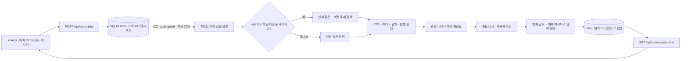

- `app/conversations.py`는 기존 `runs`를 대화 ID로 묶는다. 이전 단일 질문 결과는 결과 ID를 대화 ID로 취급해 목록에 유지한다. 질문 작업은 대화 ID를 SQLite에 저장하고, 동일 대화에 동시에 하나의 진행 중 작업만 허용한다.
- 후속 질문은 같은 볼트 설정 epoch의 완료된 최근 최대 20턴에서 턴마다 질문 최대 300자·답변 최대 600자만 맥락으로 사용한다. 지시어가 있는 질문만 직전 질문의 주제를 검색어에 더한다. 모델에 전달한 이전 답변은 사실 근거가 아니며, 답변의 인용은 이번 질문에서 다시 검증한 문단으로 제한한다.
- `web/chat.js`는 사용자·답변 메시지를 시간순으로 복원하고 `web/query-jobs.js`는 실제 처리 이벤트와 확인 대기를 이어 붙인다. `web/chat-graph.js`는 채팅 옆의 `GraphView` 하나를 관리하며, 초기에 모든 색인 완료 노트의 지도를 표시하고 질문이 시작되면 현재 배경과 이번 근거를 합친다. 이전 대화와 종료된 질문 복원만으로 전체 지도를 답변 그래프로 덮어쓰지 않는다. 그래프 내용이 같은 작업 단계 갱신은 재마운트하거나 경로를 재시작하지 않는다. 새 질문·취소·다른 대화 이후 도착한 응답과 이전 경로의 완료 콜백은 현재 화면을 덮어쓰지 않는다. `web/source-cards.js`는 기본으로 접힌 원문 근거의 네이티브 `details`/`summary`와 하나의 `dialog`를 관리한다. 요약에는 **Sources**와 근거 개수를 표시하며 펼치거나 숨길 수 있다. 펼친 타일은 기본 2열이며 `web/chat-split.css`의 컨테이너 쿼리가 채팅 영역 너비 320px 이하에서 1열로 바꾼다. 타일·답변 인용은 해당 답변의 근거 스냅샷을 상세 창에 표시하고 그래프의 같은 문단을 선택한다. 인용·그래프 노드 선택 시 해당 근거 목록의 접힘 상태를 유지하며 대응 타일을 강조하고, 그래프 노드만 선택했을 때 원문 상세 창을 자동으로 열지 않는다. 개별 **3D evidence graph**는 기본으로 펼쳐 표시하고 필요하면 접을 수 있다. `GraphView.watch()`가 뷰포트 근처의 열린 그래프만 마운트하므로 오래된 모든 답변에 WebGL 장면을 동시에 만들지 않는다. 브라우저 세션에는 현재 대화 ID를, `localStorage`에는 테마와 화면 비율을 저장하고 질문·답변은 서버 SQLite에 둔다.

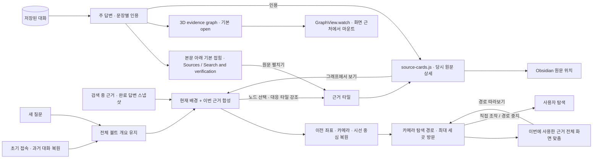

- `web/chat-split.js`와 `web/chat-split.css`는 볼트가 연결된 화면에서 채팅과 그래프를 기본 1:2 너비로 배치합니다. 사용자가 구분선을 움직이면 최소 너비를 적용한 비율로 CSS 레이아웃을 갱신하고 기존 그래프의 `ResizeObserver`가 렌더러 크기를 즉시 맞춥니다. 사용자가 카메라를 직접 조절하지 않은 경우에는 마지막 크기 변경에서 150ms 뒤 자동 화면 맞춤을 갱신합니다. 저장 비율은 구분선을 뺀 두 영역의 가용 너비를 기준으로 합니다. 그래프 장면을 다시 만들지 않아 사용자가 조절한 카메라·노드 선택·답변 근거를 유지합니다. 최대 너비를 제한하지 않고 그래프 높이를 뷰포트에 맞춥니다. 1,100px 이하에서는 세로로 배치하며 `ChatGraph.focus()`도 같은 기준으로 그래프까지 스크롤합니다.
- 새 질문은 전체 지도에서 출발해 검색 근거를 따라가고, 완료 후 이번 근거를 모두 화면에 맞춥니다. 중간 검색 상태를 표시하기 전에 완료된 질문도 먼저 유한한 경로를 재생합니다. `GraphView`는 `capture`, `journey`, `stopJourney`를 렌더러에 연결합니다. **Follow evidence / All evidence / Stop tour**와 직접 카메라 조작으로 이동을 제어하며, 경로 상태를 `canvas`의 `data-journey`와 `data-phase`에 표시합니다.
- `web/graph.js`는 실제 표시 수·생략 정보·범례를 유지하고 노드 선택 또는 탐색 안내 요청 때 상세 패널을 띄웁니다. `web/graph.css`는 이 패널과 하단 조작 도구를 그래프 위에 배치합니다. 선택 해제 후에는 그래프 공간을 다시 온전히 사용할 수 있습니다. 답변 ID별 `sourcePrefix`와 선택 콜백으로 과거 답변·진행 중 확인·원문 카드의 연결을 유지합니다.
- `app.js`의 답변 렌더러는 반복된 질문을 없애고 본문을 먼저 배치하며 원문 근거·개별 그래프·검증 정보와 과거 기록 시점 안내를 하단에 둡니다. 모든 검색 안내·경고는 **Search & verification** 안에 보존하고 접힌 제목에 안내 개수를 표시합니다. `web/chat.css`는 중첩된 본문 테두리를 없애고 16px 본문과 넉넉한 줄 간격을 적용하며, 접힌 보조 영역의 색과 크기를 낮춰 답변의 시각적 우선순위를 유지합니다.
- 원문 타일은 답변 ID와 인용 ID를 합친 DOM ID로 근거를 구분하고, `WeakMap`에 해당 스냅샷과 그래프 이동 콜백을 연결합니다. 상세 창에는 전체 원문·경로·줄·기록일·버전·검색 경로와 접을 수 있는 해시 확인란을 표시합니다. 닫기·Escape·배경 클릭 후 실행한 타일 또는 인용으로 초점을 돌려줍니다. **View in graph**는 상세 창을 닫고 해당 답변의 근거 노드로 이동합니다.

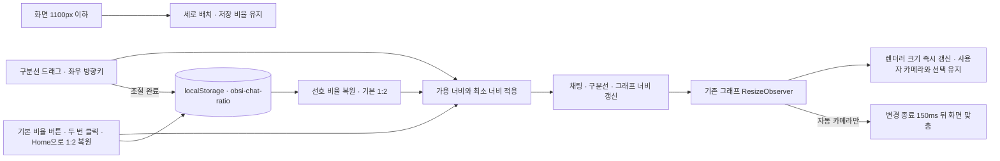

- 구분선은 키보드 초점을 받을 수 있습니다. `Shift`와 좌우 방향키는 더 큰 단계로 조절하고 드래그 중 `Escape`는 시작 전 비율로 되돌립니다. 크기 변경은 브라우저에서 처리하며 서버·모델 요청이나 새 그래프 생성이 없습니다.

## Light · Dark · AI 테마

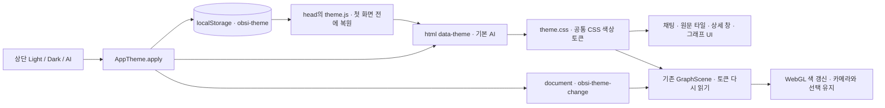

- `web/theme.js`는 `<head>`에서 저장한 테마를 읽고 없거나 유효하지 않으면 AI를 적용합니다. 상단 버튼은 `aria-pressed`로 현재 선택을 알리고 변경을 브라우저에 저장합니다.
- `web/theme.css`의 테마 토큰은 전체 UI와 그래프의 배경·노드·관계·선택 색을 함께 정의합니다. Light는 차가운 흰색/파란 강조, Dark는 검정·중성 회색/절제된 파란 강조, AI는 짙은 파란색/코발트·시안 강조를 사용합니다. 지식 분야별 10개 색상 토큰은 테마마다 같은 분야를 구분하며 배경 대비에 맞춰 밝기를 조절합니다. 각 토큰을 WebGL 재질·라벨·범례·상세 분류 배지에 함께 적용합니다.
- `graph-scene.js`는 `obsi-theme-change`를 받아 기존 장면의 재질과 배경 색을 갱신합니다. 그래프를 다시 마운트하거나 좌표를 계산하지 않으므로 카메라와 선택을 유지합니다. 테마 변경은 서버·모델 호출 없이 브라우저에서 처리합니다.

## 표시 언어와 개별 답변 그래프 수명

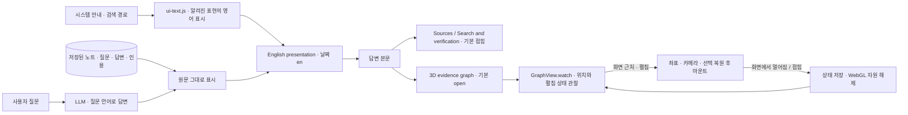

- `index.html`은 `lang="en"`을 사용하며 `ui-text.js`를 다른 지연 실행 UI 스크립트보다 먼저 로드합니다. 화면 문구·접근성 이름·입력 예시는 영어이고, 날짜와 시각의 `toLocaleString` 계열은 `en` 로케일을 사용합니다.
- `uiText()`는 알려진 시스템 메시지와 검색 경로만 표시 단계에서 영어로 바꿉니다. 사용자 질문, 노트 제목·경로·본문, 답변 문장, 인용 발췌에는 적용하지 않습니다. 저장된 한국어 콘텐츠와 스냅샷은 그대로 유지하며 새 생성 답변은 질문 언어를 따르고 불명확할 때 영어를 사용합니다.
- `app.js`는 답변별 그래프의 네이티브 `details`를 기본으로 열고 `GraphView.watch()`를 등록합니다. 원문 목록과 검증 정보의 `details`는 기본으로 닫아 둡니다. 사용자는 각각 독립적으로 접거나 펼칠 수 있습니다.
- `GraphView.watch()`의 `IntersectionObserver`는 뷰포트 주변에서만 그래프를 마운트합니다. 멀어진 그래프 또는 접힌 그래프는 `capture()`로 상태를 저장하고 장면을 해제합니다. 다시 나타나면 `viewState`와 선택 ID를 복원하며 자리표시자의 높이를 유지해 스크롤 위치 변화를 줄입니다. `GraphView.dispose()`는 장면뿐 아니라 관찰자·접기 이벤트도 해제합니다. 숨겨진 탭과 페이지의 렌더링 중지는 기존 `visibility()` 경로를 유지합니다.
