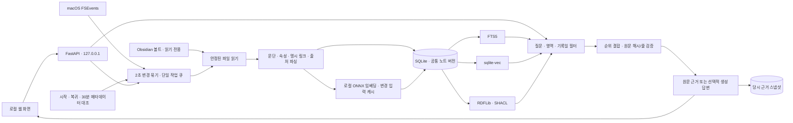
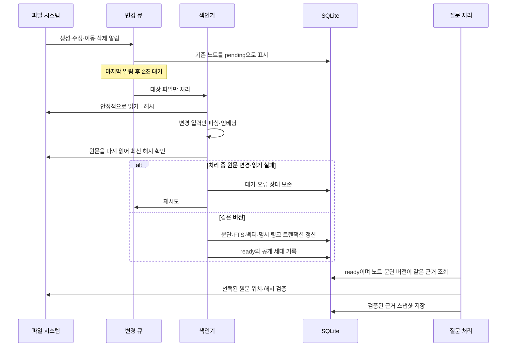
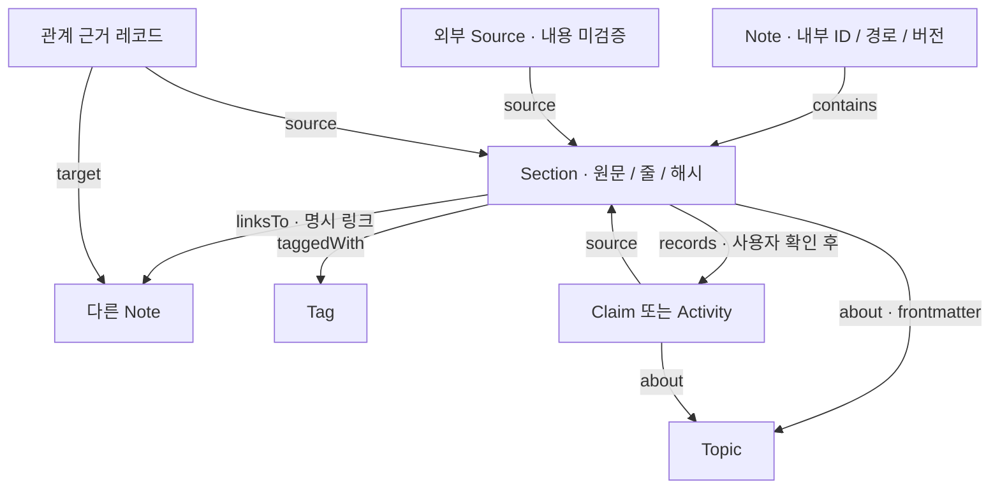
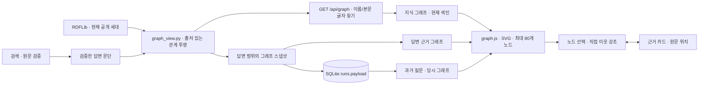
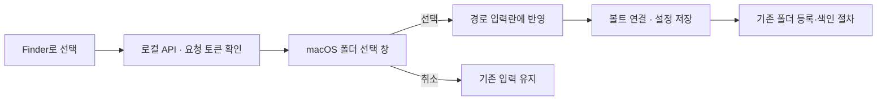
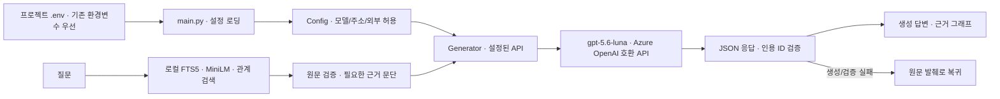
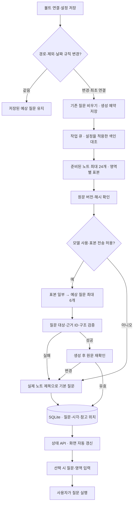

# 구현 구조와 흐름

## 구성

## 갱신의 공개 경계

질문·색인·모델 준비는 하나의 작업 슬롯을 공유합니다. 정기 검사는 질문 중에 기다립니다. OS 이벤트는 별도로 기록하므로 처리 중 발생한 변경도 다시 큐에 남습니다. 같은 데이터 폴더를 두 프로세스가 동시에 사용하는 것은 파일 잠금으로 막습니다.

## 의미 관계와 근거

- RDF는 SQLite에서 투영하며 독립적인 최신 상태를 갖지 않습니다. 공개 세대가 같으면 검증한 그래프를 재사용합니다.
- 외부 URL·문서 간 링크·동일 주제라는 이유만으로 인과 관계나 `citesAsEvidence`를 만들지 않습니다.
- LLM 후보는 확인 전 그래프에 넣지 않습니다. 명시적 `revises`/`citesAsEvidence`의 범용 매핑은 후속 확장입니다.
- SHACL은 출처·타입·관계 구조를 확인합니다. 주장 내용의 진실 여부를 확인하는 도구는 아닙니다.

## 현재의 검색 선택

FTS5는 단어 및 한글 2글자 조각을 검색합니다. sqlite-vec는 범위가 맞는 현재 모델 벡터의 코사인 거리를 계산합니다. 정확 검색 결과의 순위, 의미 검색 순위, 실제 관계 경로의 순위를 각각 가중 RRF로 결합합니다. 점수와 거리를 직접 더하지 않습니다. 제목만 있는 문단이나 frontmatter 자체는 최종 답변 발췌에서 제외합니다.

기본 순위 가중치는 단어 1, 의미 0.5, 관계 0.15입니다. 작은 가상 개발 표본에서 보정한 값이며 일반적인 최적값이 아닙니다. 관계만 많이 연결된 문서가 질문과 직접 관련된 문단을 밀어내는 문제를 줄이려는 초기값입니다.

현재 벡터 검색은 정확 거리 비교 방식이므로 노트가 커질수록 비용도 증가합니다. 사용자 볼트에서 성능 측정 전까지 대규모 처리 성능을 보장하지 않습니다.

## 그래프 화면과 답변의 연결

- `graph_view.py`는 RDF의 문서 구조·명시 관계·검토 관계를 보여줍니다. 벡터 간 거리로 새 관계를 생성하지 않습니다. 원문을 찾은 검색 경로는 별도 노드 속성으로 표시합니다.
- 질문 그래프는 검증한 근거 문단과 연결된 노트·주제·태그·판단/활동으로 제한합니다. 다른 영역/기간의 문단을 확장하지 않습니다. 과거 답변의 그래프를 현재 RDF로 재구성하지 않습니다.
- 현재 그래프와 답변 그래프는 하나의 렌더러를 공유합니다. 최대 80개 노드·200개 선만 전달하고 배치는 최초 한 번 계산합니다. 노드 선택·확대·이동에는 서버 및 모델 호출이 없습니다.
- 현재 그래프 조회는 색인 게시와 동일한 작업/저장소 잠금 범위에서 수행합니다. 갱신 대기 상태인 대상 노트를 향한 명시 링크도 RDF 공개에서 제외해 잘못된 관계와 SHACL 실패를 막습니다.

## Finder 폴더 선택

`folder_picker.py`는 고정 AppleScript와 별도 경로 인자로 폴더 선택 창을 엽니다. 폴더 선택 중에는 색인 작업 잠금을 점유하지 않으며 창 하나만 허용합니다. 폴더를 고르는 동작 자체는 볼트 연결을 변경하거나 노트를 색인하지 않습니다.

## .env와 GPT-5.6 Luna 생성 답변

인증 키는 서버에서만 읽습니다. 질문과 검색된 근거 문단을 설정한 API에 보내며 로컬 임베딩·벡터 색인의 구성은 유지합니다. `.env` 변경은 서버 재시작 시 적용합니다. 실제 연결은 가상 근거로 확인했고, 인용 ID 검증은 답변 내용의 의미적 정확성을 보장하지 않습니다.

## 볼트 설정 변경과 예상 질문

`app/suggestions.py`가 기존 검색의 문단 필터·원문 검증과 생성 API를 재사용합니다. 모델 전송은 노트당 제목·문단 제목 각 120자와 본문 600자 이내, 기록일·근거 ID로 제한합니다. 표본의 원문은 새 질문 캐시에 복제하지 않습니다. 제외 설정이 바뀌면 이전 질문을 바로 숨기며, 일반 노트 변경 때는 질문을 자동 재생성하지 않습니다. 모델 호출 실패는 기본 질문으로 복귀하고 화면 조회 때마다 재시도하지 않습니다.

외부 모델의 예상 질문 생성은 `OBSI_ALLOW_EXTERNAL_SUGGESTIONS`로 별도 제어합니다. 꺼져 있으면 기존 답변 모델 연결을 유지하면서 예상 질문만 로컬 기본 질문으로 처리합니다. 이 허용을 켜고 재시작하면 저장된 기본 질문을 한 번 갱신합니다.
