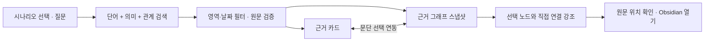

# 질문 시나리오와 그래프 사용법

볼트 연결 후에는 현재 노트에서 생성한 **예상 질문 최대 6개**를 표시한다. 경로·제외 규칙·파일명 날짜 해석을 바꾸면 이전 질문을 비우고 색인 완료 후 새 질문을 만든다. 같은 설정 저장·갱신 주기 변경·일반 노트 저장 때마다 모델을 호출하지 않는다. 생성 시각과 참고 노트 위치를 함께 표시하며, 일부 노트의 표본에서 만든 질문이므로 답변 가능 여부는 실제 검색으로 확인한다. 생성 모델이 꺼져 있거나 실패하면 실제 노트 제목으로 기본 질문을 표시한다.

외부 모델로 자동 생성하려면 `OBSI_ALLOW_EXTERNAL_SUGGESTIONS=1`이 필요하다. 답변 모델의 외부 전송 허용과 별도이며, 허용 전에는 본문을 외부로 보내지 않고 노트 제목으로 기본 질문을 만든다.

아래는 볼트 연결 전 제공하는 6가지 가상 시나리오다. `프로젝트 B`, `A기업`은 가상 샘플의 이름이다. 첫 질문 화면에서 질문을 선택하면 질문과 검색 영역이 채워진다. 기간은 초기화되며 사용자가 질문을 실행한다.

## 1. 업무 결정의 배경

- **상황:** 프로젝트를 다시 맡거나 결정의 이유를 설명해야 한다.
- **시작 질문:** “프로젝트 B의 방향을 바꾼 이유는 무엇인가?”
- **후속 질문:** “고객 인터뷰와 연결된 회의 기록을 찾아줘.”
- **확인할 근거:** 결정이 적힌 문단, 당시 회의·피드백, 기록일과 원문 위치.
- **그래프:** 결정 문단 → 명시 링크 → 프로젝트·회의 문단. 결정을 선택하면 직접 연결된 근거를 강조한다.

## 2. 계획과 실행 돌아보기

- **상황:** 주간 회고나 업무 인수인계 자료를 만든다.
- **시작 질문:** “프로젝트 B에서 계획한 일과 완료한 일을 비교해줘.”
- **후속 질문:** “이번 주 계약 화면 개선과 관련한 업무 기록을 찾아줘.”
- **확인할 근거:** 계획, 검토, 완료를 명시한 각각의 원문. 초안 완료를 배포 완료로 바꾸지 않는다.
- **그래프:** 같은 프로젝트에 연결된 계획 문단과 완료 문단. 활동 후보를 검토했다면 `검토된 활동` 노드와 기록된 상태도 표시한다.

## 3. 투자 판단의 변화

- **상황:** 특정 기업을 긍정적으로 보다가 판단을 바꾼 과정을 복기한다.
- **시작 질문:** “A기업에 대한 투자 판단은 어떻게 달라졌나? 비교해줘.”
- **후속 질문:** “현금흐름에 대한 가정과 재검토 이유가 적힌 기록을 찾아줘.”
- **확인할 근거:** 기록일 순으로 정렬한 분석, 당시 가정·조건, 보류나 변경 이유.
- **그래프:** 같은 기업 노트에 연결된 서로 다른 날짜의 문단. 날짜별 문단을 번갈아 선택해 맥락을 확인한다. `판단 변경`이라는 선을 자동으로 생성하지 않는다.

## 4. 매매의 이유 복기

- **상황:** 분석 단계의 고려와 실제 거래 기록을 구분하고 싶다.
- **시작 질문:** “A기업 매수를 검토한 이유와 실제 거래 기록을 찾아줘.”
- **후속 질문:** “매수 보류라고 적었던 기록은 어떤 원칙과 연결돼 있나?”
- **확인할 근거:** 매수 검토 원문, 매수 보류 원문, 거래라고 명시한 별도 기록. 기록에 없는 보유 상태나 거래를 추정하지 않는다.
- **그래프:** 기업 → 관련 문단, 거래 기록 문단 → 해당 노트. 수량·가격 집계나 수익률 계산 기능은 현재 제공하지 않는다.

## 5. 나의 원칙과 판단 연결

- **상황:** 투자 원칙을 어떤 분석에서 참고했는지 되짚어 본다.
- **시작 질문:** “내 투자 원칙과 연결된 분석을 찾아줘.”
- **후속 질문:** “매출과 현금흐름을 구분해야 한다고 적은 일지를 찾아줘.”
- **확인할 근거:** 원칙 원문과 원칙을 링크한 분석·투자 일지.
- **그래프:** 원칙 노트에 연결된 여러 문단을 강조한다. 유사한 내용을 찾았더라도 명시 관계가 없으면 두 기록 사이에 의미 관계의 선을 만들지 않는다.

## 6. 생각을 업무와 연결

- **상황:** 개인적으로 적어 둔 아이디어를 실제 업무와 함께 검토한다.
- **시작 질문:** “결정의 이유를 기록하자는 생각과 연결된 업무 기록을 찾아줘.”
- **후속 질문:** “판단을 바꾼 이유를 남겨야 한다는 원칙과 관련된 기록을 찾아줘.”
- **확인할 근거:** 생각이 적힌 문단, 관련 업무·투자 문단, 공통 주제나 명시 링크.
- **그래프:** 원문 문단·태그·주제를 따라 탐색한다. 연결이 없어도 단어·의미 검색으로 찾은 문단은 근거 그래프에서 검색 일치로 표시할 수 있다. 같은 주제라는 이유만으로 아이디어의 실행이나 인과 관계를 확정하지 않는다.

## 화면의 두 그래프

| 화면 | 표시 범위 | 강조 방식 |
|---|---|---|
| 지식 그래프 | 현재 공개된 색인의 일부. 이름·본문 글자 찾기 지원 | 찾은 노드는 초록 테두리, 선택 노드는 주황 테두리. 선택 노드의 직접 이웃과 연결 강조 |
| 질문 결과의 근거 그래프 | 답변에 사용한 검증된 문단, 해당 노트·태그·주제·검토된 판단/활동 | 단어·의미 검색으로 찾은 문단에 초록 테두리. 근거 카드와 그래프 선택이 연동 |
| 최근 질문을 다시 열기 | 질문 시 함께 저장한 그래프 스냅샷 | 당시 연결을 탐색. 현재 원문과 다를 수 있음을 표시 |

- 노트·원문 문단·주제·태그·검토된 판단·검토된 활동을 구분한다. 일반 생각 문장은 우선 **원문 문단**으로 보이며, 모델 제안을 사용자가 확인한 경우에만 별도 판단/활동 노드가 된다.
- 선은 원문에 있는 명시 링크, frontmatter 주제, 태그, 문서 포함 관계, 사용자 검토 관계다. 외부 URL은 이 뷰의 노드 범위에 포함하지 않는다.
- 노드 선택 시 경로·줄·버전·기록일·원문 발췌와 연결 종류를 표시하고 Obsidian으로 이동할 수 있다. 그래프 위치와 거리 자체에는 유사도 점수나 시간 순서의 의미가 없다.
- 최대 **80개 노드·200개 연결**, 중심에서 **2단계** 범위로 제한한다. 생략 수를 알리며 큰 볼트는 이름 검색으로 탐색한다. 첫 화면은 경로순 최대 12개 노트를 중심으로 시작한다.
- 그래프의 선택·확대·이동은 브라우저에서 처리한다. 이름 찾기와 그래프 조회는 임베딩/생성 모델을 호출하지 않는다. 현재 지식 그래프는 진입·찾기·새로고침 시 최신 색인을 조회하며, 열린 화면을 자동으로 바꾸지 않는다.
- 답변 그래프에는 검색 영역·기간 밖의 원문을 추가하지 않는다. 과거 질문에는 현재 그래프를 끼워 넣지 않는다. 그래프 저장 이전 버전의 질문은 재질문 안내를 표시한다.

## 현재 답변의 수준

생성 모델을 설정하지 않은 기본 모드에서는 **관련 원문과 기록일을 나란히 확인**한다. 자연어 요약·비교 설명과 의미 관계 후보 제안에는 선택적 생성 모델 설정이 필요하다. 관계 후보는 사용자 확인 후 그래프에 들어간다. 현재 생성 모델을 통한 의미적 정확성, 실제 사용자 볼트의 검색 품질은 별도 검증 대상이다.

