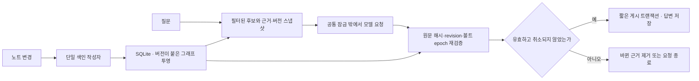

# 리팩토링 및 Rust 도입 검토

검토일: 2026-09-28. 기준: `feat/3d-graph`, HEAD `d86ad00`와 저장된 작업 파일. Whiteboard의 현재 구조를 실제 코드와 대조했다. 1–5절은 리팩토링 전 기준선과 제안이다. **2026-09-28 구현 결과와 남은 항목은 6절**을 참고한다. 당시 코드 줄 번호는 현재 파일과 다를 수 있다.

**Python을 유지하면서 잠금·조회량·그래프 재생성을 먼저 개선한다. Rust는 개선 후에도 남는 관계 조회 또는 텍스트 처리의 CPU 병목에 한정해 검증하는 것이 합리적이다.** 모델 호출 대기와 전체 데이터를 반복 처리하는 구조는 언어를 바꾸어도 남는다.

## 1. 직접 측정한 기준선

실제 볼트 대신 가상 노트 100/500/1,000개를 임시 폴더에 생성했다. 노트마다 문단 4개, 다음 노트의 제목을 가리키는 링크 1개, 20개 중 하나의 공통 주제를 넣었다. `tests/conftest.py`의 결정적 384차원 FakeEmbedder를 사용했고 원격 API·ONNX 추론·파일 감시·HTTP 서버는 실행하지 않았다. Python 3.12.11, macOS ARM64에서 수행했다.

아래는 같은 프로세스에서 순차 실행한 3회의 중앙값(ms)이다. p95나 대규모 볼트 성능 보장이 아니다. 처음 전체 색인과 노트 1개 변경은 각각 1회 측정했다. 프로파일링은 별도 실행하여 표의 시간에서 제외했다.

| 단계 | 노트 100 / 문단 400 | 노트 500 / 문단 2,000 | 노트 1,000 / 문단 4,000 |
|---|---:|---:|---:|
| 변경 없는 메타데이터 대조 | 2.3 | 12.3 | 24.1 |
| RDF 전체 생성 + SHACL | 59.7 | 343.2 | 742.8 |
| 현재 그래프 투영, RDF 준비 상태 | 6.9 | 35.6 | 74.5 |
| FTS 검색 | 2.2 | 10.1 | 20.3 |
| FTS + 벡터 검색 | 4.0 | 25.4 | 54.5 |
| FTS + 벡터 + 관계 검색 | 34.0 | 77.0 | 131.3 |
| 원문 검증·그래프·저장 포함 답변, LLM 제외 | 42.2 | 98.6 | 165.2 |
| 노트 1개 변경 색인, 1회 | 8.4 | 33.6 | 96.9 |
| 변경 후 RDF 갱신, 1회 | 74.6 | 340.9 | 756.3 |

변경 없는 대조의 본문 읽기와 임베딩 호출은 세 규모 모두 0회였다. 노트 하나를 수정해도 RDF 재생성 비용은 전체 규모를 따라 커졌다. 1,000개 노트의 별도 cProfile에서는 `Ontology.refresh → pyshacl.validate`, `Search.retrieve → Ontology.neighbors → RDFLib SPARQL`에 시간이 집중됐다. 프로파일 시간은 계측 오버헤드가 있어 표의 벽시계 시간과 합산하지 않는다.

이는 **이 가상 데이터에서 그래프 처리 최적화가 파일 스캐너 교체보다 우선**이라는 근거다. 실제 문서 길이·연결 밀도·iCloud 상태·모델 지연·동시 요청이 다른 환경에는 그대로 외삽하지 않는다. Rust 구현과의 비교는 수행하지 않았으므로 예상 배속도 제시하지 않는다.

- 원시 결과: [refactor-baseline.json](benchmarks/refactor-baseline.json)
- 재현 스크립트: [refactor_baseline.py](benchmarks/refactor_baseline.py)
- 프로젝트 루트에서 `PYTHONPATH=. uv run --offline --no-sync python docs/benchmarks/refactor_baseline.py /tmp/obsi-refactor-result.json`
- 설치된 개발 의존성을 사용한다. `.env`를 읽지 않고 임시 볼트·DB만 사용한다. 시험용 벡터이므로 의미 검색 품질 평가에는 사용할 수 없다.

## 2. 리팩토링 우선순위

P0는 다음 구현에서 먼저 다룰 기반 작업, P1은 이어서 적용할 성능·복구 개선, P2는 규모나 운영 요구에 따라 적용할 항목이다. 심각도 판정은 아니다.

| 우선순위 | 항목과 현재 근거 | 제안 | 완료 기준 |
|---|---|---|---|
| P0 | `api.py:156–165`, `service.py:190–223`: 질문과 색인이 `operation`을 공유하며 모델 HTTP 대기도 잠금 안에 포함 | 검색 근거·버전의 스냅샷 확보 / 모델 대기 / 재검증·저장을 분리. 모델 작업 수를 제한하고 취소 상태 관리 | 느린 가짜 모델을 기다리는 중 다른 노트 색인·현재 그래프 조회 가능. 근거 변경·볼트 초기화·취소 시 이전 작업 결과가 재게시되지 않음 |
| P0 | `storage.py:52–88`: SQLite 연결 하나와 RLock을 공유 | 먼저 일관된 읽기 스냅샷 경계를 정의. 필요하면 읽기 연결과 단일 쓰기 소유자 분리. 짧은 트랜잭션과 잠금 순서 명시 | note/section/RDF 세대가 섞이지 않음. 잠금 대기·취소·종료 시나리오 회귀 검증 |
| P0 | 사용자 추가 요구: 답변 처리 단계 표시와 중요한 기록 충돌의 선제 질문 | 질문 작업 상태·진행 이벤트·충돌 후보·사용자 확인 대기/재개를 도입. [상세 설계](answer-progress-and-clarification.md) | 실제 수행 단계 표시, 양쪽 출처 제시, 보류/재개, 버전 변경·중복 제출·재연결 처리. 사용자 대기 중 색인 진행 |
| P1 | `ontology.py:95–191`, `193–219`: 세대 변경 시 전체 RDF/SHACL, 검색 시 seed별 SPARQL 반복 | 준비된 쿼리 재사용, 노트→문단/주제→문단 인접 인덱스, 고정 관계 조회의 SQL 대안 비교. 변경 범위 추적 후 검증된 세대를 한 번에 교체 | 기존 관계·출처·범위 결과와 동일. 작은 변경의 비용 감소. SHACL을 없애지 않고 영향 범위 검증과 전체 검증의 역할을 명시 |
| P1 | `ontology.py:19–86`: 링크 재해결과 anchor 검색에서 전체 문단 반복; `graph_view.py:25–158`: 표시 제한 전에 전체 투영 | 노트별 section/anchor 인덱스, 변경 대상과 역방향 링크만 재해결. 조회 범위와 인접 노드를 먼저 선택한 뒤 상세 데이터를 구성 | 이름 충돌·rename·삭제·anchor 결과 유지. 최대 80개 표시를 위해 전체 본문을 읽는 경로 축소 |
| P1 | `search.py:105–174`: eligible 전체 본문, FTS 전체 hit, Python ID 목록 | DB에서 domain/date/ready/revision 필터 적용 후 route별 후보 ID·점수만 조회. 순위 결합 후 필요한 상위 문단 본문만 읽기 | 범위 밖 결과가 상위 후보를 밀어내지 않음. 기존 RRF·인용·검색 품질 유지, 할당 메모리와 조회 시간 감소 |
| P1 | `indexer.py:185–190,264–279`, `service.py:215–219`: 텍스트 ready + 벡터 pending은 빠른 재시도 대상에서 빠짐 | 텍스트 상태와 임베딩 상태/모델 버전 분리, 벡터 실패 재시도 시각과 backoff 관리 | 모델 일시 실패 복구 후 파일 수정 없이 의미 색인 복구. 성공한 입력 재호출 및 무한 재시도 방지 |
| P1 | `search.py`가 검색·검증·답변·후보 추출을 함께 처리하며 dict 계약 사용 | 기존 모듈 안에서 Evidence/QueryPlan/AnswerSnapshot의 명시적 타입 도입 후 변경 이유가 다른 책임만 작은 모듈로 분리. 모델 JSON은 Pydantic 등으로 구조 검증 | 잘못된 타입·빈 인용·후보 형식에 대한 일관된 fallback. 기존 파일에 유사 검증 함수를 중복 생성하지 않음 |
| P2 | `service.py:225–270`, `web/app.js:84–89`: 상태 조회마다 전체 노트 목록을 반복 전송 | 가벼운 진행 요약과 페이지별 노트 목록 분리, 일관된 상태 스냅샷과 오류 유형 | 노트가 늘어도 진행 표시 응답 크기 제한. UI가 텍스트 최신/벡터 대기를 구분 |
| P2 | `storage.py`, `suggestions.py`: 캐시·과거 답변 보존, 설정 초기화와 스키마 변경이 직접 SQL에 결합 | 명시적 스키마 버전/마이그레이션, 캐시 정리, 질문 이력 보존 정책. 예상 질문 재생성 시점은 제품 요구로 별도 결정 | 재시작/구버전 DB/삭제 후 복구 검증. 원본 노트 보존과 과거 스냅샷 의미 유지 |

파일을 나누는 일은 읽기 쉽게 만드는 데 의미가 있지만 실행 속도를 직접 높이지 않는다. 현재 최대 약 359줄인 Python 파일에 대규모 계층 구조나 서비스 프레임워크를 추가할 근거는 없다.

## 3. 잠금 분리 시 지켜야 할 설계

이 그림은 목표 구조다. `async def`만 붙이거나 공통 잠금을 제거하는 변경으로는 충분하지 않다. 현재 RLock은 스레드 기준이므로 await를 가로지르는 요청 격리 수단으로 재사용하면 안 된다. WAL도 현재의 단일 연결·공통 RLock을 자동으로 병렬화하지 않는다. 별도 읽기 연결과 짧은 읽기 트랜잭션을 사용하더라도 SQLite 쓰기는 단일 작성자로 관리한다. [SQLite WAL의 동시성 설명](https://www.sqlite.org/wal.html)

근거에는 vault epoch, note ID, section ID, revision, hash와 확인 시점을 기록한다. 다른 노트만 바뀐 경우와 해당 근거가 바뀐 경우를 구분한다. 전체 삭제/볼트 변경은 epoch를 바꾸고 진행 중 결과의 저장을 막아야 한다. 답변 그래프는 근거 스냅샷과 같은 버전에서 만든다. 파일 시스템과 DB를 하나의 원자적 트랜잭션으로 묶을 수 없으므로, 검증 시점과 관찰된 원본 버전을 명시한다.

## 4. Rust 전환 판단

| 영역 | 판단 | 이유와 적용 조건 |
|---|---|---|
| FastAPI·설정·작업 조율·모델 요청 | Python 유지 | 주된 과제는 대기와 상태 관리다. Rust HTTP 서버로 전면 교체할 측정 근거가 없음 |
| SQLite FTS5·sqlite-vec | 현재 엔진 유지 | sqlite-vec는 이미 C 구현이다. Python→Rust 래퍼 변경보다 SQL 후보 축소·접근 방식 개선이 먼저. 현재 저장소는 sqlite-vec 0.1.6을 고정하므로 최신 엔진 기능을 그대로 가정하지 않음 |
| FastEmbed / ONNX 추론 | 현재 엔진 유지 | 현재 코드가 ONNX CPU 실행 공급자를 사용한다. 호출 언어를 바꾸어도 같은 추론 커널 비용은 남음. 실제 모델의 배치·스레드·캐시를 먼저 측정 |
| 관계 이웃 조회·bounded graph 구성 | **가장 유력한 부분 전환 후보** | Python 인접 인덱스·준비된 SPARQL/SQL 최적화 후에도 CPU 병목이면, 작은 Rust 그래프 코어 또는 Rust 기반 엔진의 Python 바인딩을 비교 |
| Markdown 파싱·한글 토큰 생성 | **조건부 두 번째 후보** | 대량 초기 색인에서 순수 Python 텍스트 처리 비용이 확인될 때만. 현재 표본은 대용량 긴 본문을 검증하지 않음. 줄 번호·줄바꿈 정규화·태그·링크·frontmatter 호환성을 먼저 고정 |
| 파일 감시·스캔·해시 | 당장 전환하지 않음 | 변경 없는 대조 24ms/1,000노트, 본문 읽기 0회. OS 알림과 디스크/iCloud 제약은 Rust에서도 존재. 해시 함수만 교체할 근거 없음 |
| 3D 화면 | 현행 JavaScript / WebGL 유지 | 서버 Python과 별개이며 노드 수도 제한됨. WASM/Rust 추가 이득을 입증하지 못함 |

sqlite-vec의 C 구현은 [공식 저장소](https://github.com/asg017/sqlite-vec), ONNX의 최적화된 커널과 실행 공급자는 [공식 문서](https://onnxruntime.ai/docs/)에서 확인했다. 따라서 “대부분의 소스가 Python”이 곧 “대부분의 계산을 Python 인터프리터가 수행”한다는 뜻은 아니다.

**Rust를 도입한다면 Python에서 호출하는 작은 모듈부터** 시작한다. `expand_neighbors(seed_ids, eligible_ids, generation)` 또는 배치 `parse_notes(inputs)`처럼 입력·출력이 명확한 경계로 잡고, 문자열/노드마다 언어 경계를 왕복하지 않는다. Rust 연산은 Python 객체를 계속 만지지 않는 구간으로 묶는다. [PyO3의 병렬 실행 안내](https://pyo3.rs/main/parallelism.html), [maturin 패키징](https://www.maturin.rs/)을 이용할 수 있지만 macOS arm64/x86_64 wheel, Python 버전, 디버깅·오류 변환 비용이 추가된다.

그래프 쿼리는 직접 다시 작성하기 전에 [Oxigraph/pyoxigraph](https://github.com/oxigraph/oxigraph)도 비교 후보로 삼을 수 있다. Rust RDF/SPARQL 구현과 Python 바인딩이 있지만 현재 RDFLib/pySHACL 구성의 대체가 자동으로 성립하지 않는다. RDF 변환 비용, 인용과 쿼리 결과 동등성, SHACL의 별도 처리, 배포 크기를 포함해 비교해야 한다. SQLite가 원장인 현재 구조에서 독립적인 두 번째 원장을 추가하지 않도록 파생 투영으로 제한한다. 이번에 설치하거나 속도를 비교하지는 않았다.

Rust의 타입/소유권 검사는 Rust로 작성한 부분의 데이터 경합과 메모리 오류 예방에 도움이 되지만, 근거 버전 혼합·누락된 재시도·iCloud 지연·잘못된 투자 해석은 별도 설계와 검증이 필요하다. PyO3 네이티브 모듈은 Python과 같은 프로세스이므로 프로세스 장애 격리도 제공하지 않는다. 별도 프로세스는 장애 격리가 실제 요구가 된 경우에만 IPC·재시작 비용까지 검토한다. Rust [notify 문서](https://docs.rs/notify/latest/notify/)도 파일 감시의 플랫폼별 한계를 설명한다.

## 5. 권장 실행 순서와 통과 조건

1. **측정·계약 고정**: 단계별 시간/잠금 대기/메모리·오류 상태 측정과 기존 출처·검색 결과 회귀 표본을 준비한다. 실제 규모의 합성 데이터에서 반복 수를 늘려 p50/p95와 RSS를 수집한다. LLM 네트워크 지연과 로컬 계산을 분리한다.
2. **Python 구조 개선과 확인 대화**: 모델·사용자 대기 잠금 분리, vault epoch/취소 계약, 실제 진행 이벤트, 충돌 후보와 선제 질문·응답 후 재개, 임베딩 재시도. 느린 모델/사용자 응답 중 편집·삭제·설정 변경을 주입해 결과를 검증한다. 단계 설명은 수행 작업과 근거를 요약하며 내부 추론 원문은 노출하지 않는다.
3. **조회·그래프 최적화**: 전체 본문 로딩 축소, 인접/anchor 인덱스, 준비된 쿼리, 영향 범위별 투영·검증. 필터와 승인된 관계 의미를 보존하며 기준선과 비교한다.
4. **Rust 실험 여부 결정**: 위 변경 후에도 목표 응답 시간을 못 맞추고 동일한 CPU 구간이 지속적으로 지배할 때만, 한 후보를 Python 최적화 버전과 A/B 비교한다.

Rust 도입 판정은 같은 입력·같은 검색 결과·동일한 인용으로 전체 요청 p95, CPU, RSS, 배포 크기, 실패 복구를 비교한다. FFI 데이터 변환을 포함한 순이득이 없으면 Python 구현을 유지한다. 작은 함수의 마이크로벤치 배속만으로 채택하지 않는다. 이 검토에서는 목표 SLO나 Rust의 기대 배속을 확정하지 않았다.

기존 `tests/test_indexing.py`, `test_search.py`, `test_graph.py`, `test_api_watcher.py`, `test_suggestions.py`의 출처·필터·갱신 불변식을 회귀 기준으로 재사용한다. 파서 전환에는 한글·emoji·CRLF·BOM·코드 블록·동명이 링크·줄 번호의 골든 비교가 추가로 필요하다. 그래프 전환에는 삼중항/관계 집합과 순위의 동등성 검증이 필요하다.

## 6. 2026-09-28 구현 결과

작업 브랜치 `codex/query-workflow-refactor`. 잠금 밖 모델 대기, 영속 질문/이벤트와 사용자 확인, 원문/epoch 재검증과 원자적 게시를 적용했다. FTS 후보 제한, 본문 지연 조회, RDF 인덱스 이웃 탐색, 노트별 링크 맵, 답변 그래프 SQL 범위 제한 및 벡터 backoff 복구를 구현했다. 의미 관계 결과는 기존 SPARQL과 동등성 테스트로 비교했다. 보안 보강·검증 범위는 [구현 결과](refactor-implementation.md)에 정리했다.

아래는 동일 스크립트/가상 데이터의 전후 중앙값(ms)이다. 모델·네트워크·감시 제외, 세 번 측정(초기 색인/노트 변경은 한 번). 실제 사용자 환경의 SLO나 의미 품질 수치가 아니다.

| 1,000개 노트 / 4,000개 문단 | 이전 | 이후 |
|---|---:|---:|
| FTS 검색 | 20.317 | 8.513 |
| FTS + 벡터 + 관계 검색 | 131.287 | 39.926 |
| LLM 제외 전체 답변 | 165.180 | 79.206 |
| 변경 없는 메타데이터 대조 | 24.094 | 24.844 |
| 전체 RDF/SHACL | 742.818 | 720.944 |
| 현재 볼트 그래프 투영 | 74.518 | 74.348 |
| 초기 전체 색인, 1회 | 2130.753 | 2724.463 |

검색은 약 3.3배, LLM 제외 답변은 약 2.1배 짧아졌다. 답변은 추가 문단/충돌 규칙/작업 상태 저장을 포함하도록 기능이 늘어났으므로 구성 요소별 동일 작업 시간과 구분한다. 초기 색인은 이번 단일 측정에서 약 28% 느려졌고 개선으로 주장하지 않는다. 안전한 파일 열기·파싱 제한 비용과 측정 환경 변동을 분리한 추가 계측은 수행하지 않았다. 원시값과 표본 100/500개 결과는 [이후 JSON](benchmarks/refactor-after.json)에 있다. 변경 없는 대조는 모든 표본에서 본문 읽기/임베딩 0회를 유지했다.

**남은 항목:** 전체 RDF/SHACL 갱신, 현재 볼트 그래프 전체 투영, 상태 API의 노트 목록, 정확 벡터 검색 비용과 단일 DB 연결. 이번 성능 개선은 Python 조회 구조만으로 얻었다. Rust 전환은 구현하지 않았으며 남은 CPU 병목의 실제 볼트 계측 후 판단한다. 증분 검증/별도 읽기 연결/재사용 확인 규칙은 이번 완료 범위에 포함하지 않는다.
