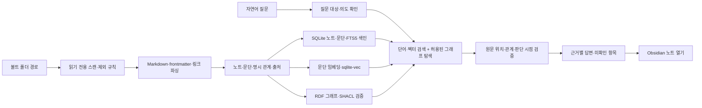
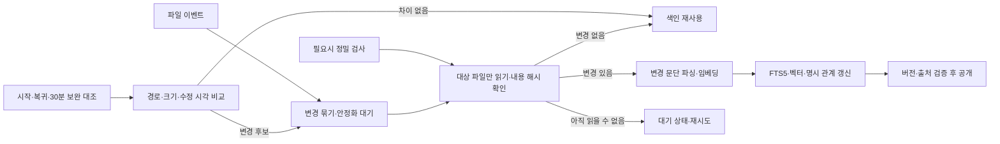

# Obsidian Ontology Q&A · 초기 설계

작성일: 2026-09-24. 수정일: 2026-09-27. 상태: 로컬 MVP 구현·가상 샘플 검증 완료. 실제 볼트 검증 대기.

## 1. 목표와 입력 계약

사용자가 **로컬 Obsidian 볼트 폴더 경로**를 선택하면 Markdown 노트의 내용과 명시적 관계를 색인하고, 자연어 질문에 원문 위치가 연결된 답을 제공한다. 사용자가 근거를 누르면 해당 노트와 제목으로 이동한다. 원본 볼트는 읽기 전용으로 다룬다.

**확인된 콘텐츠:** 사용자의 평소 생각, 회사 업무, 투자 분석과 매일의 투자 일지다. 공통 의미 모델은 대상·생각/판단·활동·근거·기록 시점으로 두고 업무와 투자에서 필요한 유형·관계만 추가한다. 한 일일 노트에 여러 영역이 섞여 있어도 문단별로 주제를 연결하고, 하나의 문단에도 여러 주제를 허용한다. 기존 노트를 정해진 양식으로 다시 작성할 필요 없이 원문 검색부터 사용할 수 있어야 한다. 온톨로지를 통한 추가 효과는 실제 노트로 검증한다.

**확정한 기술 방향:** SQLite에 노트 정보와 검색 데이터를 저장하고, **FTS5 단어 검색 + sqlite-vec 벡터 검색 + RDFLib/pySHACL 온톨로지 관계 조회·검증**을 결합한다. 검색·출처·날짜 처리는 세 영역이 공유하며, 생성 모델을 켜면 조회한 근거로 답변을 작성한다. 벡터 검색에 필요한 임베딩 모델과 답변을 작성하는 생성 모델은 별도로 설정한다.

우선 검증할 질문 예시는 다음과 같다. 아래 기업명은 가상 예시다.

| 질문 | 필요한 연결 |
|---|---|
| 지난주 프로젝트 B에 관해 어떤 업무를 했다고 기록했나? | 프로젝트 → 업무 활동 → 활동일·일일 기록 |
| 이 업무 결정은 어떤 논의와 근거에서 나왔나? | 프로젝트 → 결정 → 회의/논의 기록·근거 |
| 내가 A기업을 긍정적으로 본 이유는 무엇이었나? | 투자 대상 → 당시 판단 → 원문에 제시한 근거 |
| A기업에 대한 생각이 이전 기록과 어떻게 다른가? | 같은 대상 → 날짜가 확인된 판단들 → 원문 비교 |
| 이번 주 투자 일지에 어떤 판단과 행동을 남겼나? | 날짜 범위 → 투자 판단·기록된 행동 → 해당 원문 |
| 내 투자 원칙과 함께 검토할 만한 분석은 무엇인가? | 원칙 → 관련 분석 → 조건과 맥락 비교 |
| 여러 기록에서 반복해서 다룬 관심사는 무엇인가? | 주제 → 관련 문단·노트 → 기록 시점 |

답변은 기록에 드러난 생각을 설명한다. 투자 노트의 주장은 작성 당시 사용자의 판단 또는 인용된 자료의 주장으로 다루며, 검증된 현재 시장 사실로 표시하지 않는다. 분석 기록만으로 실제 보유·매매를 추정하지 않는다. 최근 글의 입장을 곧바로 현재 입장으로 간주하거나 글 몇 개로 성격을 단정하지 않는다.

업무 계획과 완료한 활동, 투자 전망·매수 검토와 실제 매매 기록을 구분한다. 실제 매매가 기록된 경우에만 거래 행동을 만들며 수량·가격·거래일 등은 명시된 값만 저장한다. 기록이 없는 날은 미상으로 취급한다. 날짜별 조회는 요청한 기간의 색인된 관련 기록을 확인하고, 검색 결과 일부만으로 기간 전체를 설명할 때는 누락 가능성을 표시한다.

**확정한 입력 방식:** 일반 로컬 볼트와 iCloud Drive 볼트 모두 사용자가 지정한 폴더 경로로 연결한다. 앱은 해당 경로의 파일을 읽으며 iCloud 동기화는 운영체제가 담당한다. `obsidian://` URI는 답변에서 원본 노트를 열 때 사용한다. Obsidian의 [볼트 저장 방식](https://obsidian.md/help/data-storage)과 [URI 형식](https://help.obsidian.md/Extending%2BObsidian/Obsidian%2BURI)에 따른 구분이다.

iCloud에만 있고 아직 로컬에서 읽을 수 없는 파일은 `다운로드 대기/읽기 실패`로 표시하고 색인의 불완전성을 알린다. 임시 읽기 실패를 삭제로 간주하거나 이전 색인 내용을 최신 근거로 사용하지 않는다. 다운로드 후 재색인한다. 초기 연결 안내에는 볼트 폴더의 **다운로드 유지(Keep Downloaded)** 설정을 권장한다([Obsidian 공식 안내](https://obsidian.md/help/sync-notes)).

### 1차 성공 기준

1. 볼트를 등록하면 `.md` 파일을 색인하고, 제외 경로와 오류를 보여준다.
2. `[[링크]]`, 일반 Markdown 내부 링크, 제목·블록 대상, 별칭, 태그, frontmatter 관계를 가능한 범위에서 해석한다. 같은 이름의 노트가 여럿이면 임의로 하나를 선택하지 않는다.
3. 질문마다 조회 경로와 사용한 노트·문단·관계가 보인다. 답변의 각 사실 문장은 실제 근거 위치를 인용한다.
4. 근거가 부족하거나 충돌하면 단정하지 않고 부족한 정보와 충돌한 원문을 보여준다.
5. 노트 추가·수정·이동·삭제 후 재색인하면 결과가 갱신되고 삭제된 내용이 답변에 남지 않는다.
6. 앱은 기본적으로 질문·노트를 외부 서비스로 보내지 않는다. 임베딩은 로컬 모델을 기본 설계로 두고, 외부 임베딩을 선택하면 색인 대상 문단이 전송된다는 점을 설정에 명시한다. 외부 생성 모델에는 답변용 질문·선택된 근거 문단, 또는 예상 질문 생성용의 제한된 노트 표본을 보낸다. 두 외부 모델 설정은 독립적이며 운영체제의 iCloud 동기화·다운로드는 별개다.
7. 혼합된 일일 노트에서 질문에 맞는 업무·투자·개인 문단을 찾고, 기록일과 실제 활동일이 다른 경우 이를 답변에 보존한다.
8. 파일 생성·수정·재생성·이동·삭제를 자동 감지하고, 동일 내용의 반복 저장은 중복 색인·임베딩 생성을 일으키지 않는다. 앱이 꺼진 동안의 변경은 재시작 시 반영한다.

## 2. 참고 프로젝트에서 가져올 것

`../kt-skylife-ontology`의 `app/ontology.py`, `app/knowledge.py`, `app/free_plan.py`, `app/free_questions.py`, `ontology/`, `app/storage.py`를 설계 참고로 사용한다.

| 가져올 원칙 | Obsidian용 변경 |
|---|---|
| RDF 객체·관계, 출처, SHACL 검증 | Note·Section·Topic·Claim·Activity·Source·Tag와 볼트별 속성 매핑 |
| 서버가 허용한 관계 조회와 원문 검색 | 질문을 허용된 검색·그래프 연산으로 계획하고, 임의 SPARQL 실행은 막음 |
| 단계별 실행 기록과 문장별 인용 ID 검증 | 노트 경로·제목·문단·줄 번호·내용 해시까지 검증 |
| 근거 부족 시 중단/부분 답변 | 미해결 링크·동명이 노트·상충하는 메타데이터를 별도 표시 |

KT 사업별 15개 시나리오, CSV 필드 매핑, 업무 규칙, 승인 큐, 3D 그래프는 이 프로젝트의 기본 요구가 아니다. 처음에는 질문과 근거 탐색에 집중한다.

## 3. 최소 온톨로지

| 객체 | 설명 |
|---|---|
| Vault | 선택한 로컬 볼트 |
| Note | Markdown 파일. 내부 ID, 현재 상대 경로, 제목, 별칭, 수정 시각, 내용 해시를 가짐 |
| Section | 제목 아래의 인용 가능한 내용 단위. 원문 시작·끝 줄을 가짐 |
| Topic | 관심 주제 또는 기록 대상. 프로젝트·사람·조직·기업·ETF 등은 명시된 경우 유형·식별자를 추가 |
| Claim | 원문에 기록된 생각·원칙·업무 결정·투자 가설·전망. 주장 주체, 조건, 날짜와 그 출처를 보존 |
| Activity | 기록된 업무·회의·투자 행동. 계획/완료 등 상태와 활동일은 근거가 있을 때만 부여 |
| Source | 사용자가 근거로 인용한 외부 자료의 식별 정보. 링크만 수집한 자료는 내용 미검증으로 표시 |
| Tag | Obsidian 태그 |

기본 문서 관계는 `contains`(볼트→노트, 노트→문단), `linksTo`, `taggedWith`다. 의미 관계는 `records`(문단→판단/활동), `about`(판단/활동→대상), `citesAsEvidence`(판단→근거 문단/외부 자료), `revises`(새 판단→이전 판단)부터 시작한다. 하나의 노트는 여러 주제·판단·활동을 담을 수 있고, 같은 대상을 여러 날짜의 노트가 설명할 수 있다. 업무·투자·개인 영역은 탐색 필터로 사용하며 분류만으로 관계나 인과를 만들지 않는다.

관계에는 `explicit_link`, `frontmatter`, `user_mapping`, `extracted_candidate` 등의 생성 근거와 원문 위치를 기록한다. 본문만 있는 노트도 검색·인용할 수 있다. 의미 관계의 자동 추출은 선택적 모델 기능으로 두고, 질문에 필요한 문단에서 후보를 제안한다. 후보는 원문과 함께 보여주되 검토되기 전까지 확정된 관계 경로에 넣지 않는다. 모든 노트를 미리 검토해야 질문할 수 있는 흐름은 만들지 않는다.

예: “A기업은 현금흐름이 개선돼 긍정적으로 본다”는 판단을 A기업이라는 대상과 해당 근거 문단에 연결할 수 있다. `[[A기업]]`만 있는 경우에는 문서 링크만 만든다. 두 글이 다른 견해를 담고 있어도 조건·시점이 다를 수 있으므로 `revises`는 명시적 수정 표현이나 사용자 확인이 있을 때 만든다. `citesAsEvidence`는 사용자가 근거로 삼았다는 뜻이며, 그 자료가 주장을 객관적으로 입증한다는 뜻은 아니다.

날짜는 일일 노트의 기록일, 명시된 활동일·판단일·거래일·분석 대상 기간과 파일 수정 시각을 구분한다. 파일명 날짜는 확인된 일일 노트 명명 규칙으로 기록일에 매핑하고, 모든 문장의 사건 날짜로 사용하지 않는다. 날짜가 없으면 미상으로 남긴다. 현재 파일에 남아 있지 않은 과거 문장을 복원할 수 있다고 가정하지 않는다. 생각의 변화는 남아 있는 과거 기록과 색인 이후 보존한 근거 스냅샷 범위에서 설명한다.

인덱스의 내부 ID는 경로와 분리한다. 이동·이름 변경을 감지하면 기존 노트 ID를 유지하고 현재 경로를 갱신한다. 이름·내용이 모두 같은 파일처럼 모호한 경우 자동 병합하지 않고 다시 확인한다. 원본 노트에 ID를 써 넣지는 않는다.

## 4. 처리 흐름

1. **수집:** `.md` 파일만 읽고 `.obsidian`, `.git`, 앱의 색인 폴더와 사용자가 지정한 비공개 폴더를 제외한다. 심볼릭 링크로 선택한 볼트 밖으로 나가지 않는다. 첨부 파일은 1차에서 파일명·링크만 기록한다.
2. **파싱:** YAML/JSON frontmatter, 제목, 본문, `[[위키 링크]]`, `[Markdown 링크](...)`, 태그와 별칭을 읽는다. Obsidian은 두 내부 링크 형식을 지원한다([공식 문서](https://obsidian.md/help/links)). 속성은 frontmatter에 저장된다([공식 문서](https://obsidian.md/help/properties)). 미해결·동명이 링크는 색인 품질 화면에 표시한다.
3. **정규화:** 하나의 파싱 결과에서 문단·FTS5·벡터·근거 관계를 만든다. 세 검색 경로는 공통 문단 ID와 노트 버전을 사용한다. 모든 그래프 관계에 원문 파일·줄 위치·내용 해시를 붙인다. SQLite 갱신과 RDF 투영은 같은 공개 버전을 조회하도록 제어하며, 새 원문과 이전 벡터·관계가 섞인 결과를 반환하지 않는다.
4. **질문 계획:** 업무·투자·개인/전체 범위, 대상 주제/판단/활동, 기간과 `찾기·요약·비교·개수·연결 설명`을 확인한다. 모델이 계획을 제안할 수 있지만 서버는 허용된 연산·범위만 실행한다. 대상이 모호하면 보완을 요청한다.
5. **근거 조회:** FTS5로 정확한 이름·단어를 찾고, sqlite-vec로 의미가 유사한 문단을 찾은 뒤 실제 관계로 맥락을 보충한다. 업무/투자/개인 범위·기간 필터는 모든 경로에 동일하게 적용한다. 서로 단위가 다른 FTS 점수와 벡터 거리를 직접 더하지 않고, 순위에 따라 후보를 합쳐 공통 문단 ID로 중복을 제거한다. 관계를 여러 단계 건너갈 때는 경로 전체를 답변에 표시한다.
6. **답변:** 조회한 원문 조각만으로 답을 만들고, 문장별 `note_id + section_id + line range + hash`를 검증한다. 인용 ID 일치 검사는 의미적 사실성을 보증하지 않으므로 계산·날짜 비교는 서버가 수행하고 원문을 함께 보여준다. 답을 찾지 못하면 추측 대신 검색 범위와 부족한 근거를 말한다.

### 확정한 저장·검색 구성

| 역할 | 기술 | 관리 대상 |
|---|---|---|
| 원문 색인·메타데이터·작업 상태 | SQLite | 노트/문단 ID, 경로, 날짜, 해시, 버전, 원문 근거 관계, 실행 기록 |
| 단어 검색 | SQLite FTS5 | 제목·별칭·태그·본문의 검색 색인 |
| 의미 검색 | sqlite-vec | 문단 ID에 연결된 임베딩과 모델·차원 정보 |
| 의미 구조·관계 조회 | RDFLib | SQLite의 공개 버전에서 구성한 RDF 그래프와 허용된 SPARQL 조회 |
| 구조 검증 | pySHACL | 타입·관계·필수 출처의 제약 검사 |
| 파일 변경 감지 | Python 파일 감시기 | 등록한 볼트의 생성·수정·이동·삭제 이벤트 |

`sqlite-vec`는 버전을 고정하고 원문과 모델 정보에서 색인을 다시 만들 수 있게 한다. 확장의 1.0 이전 변경 가능성은 [공식 저장소](https://github.com/asg017/sqlite-vec)에 명시되어 있다. DuckDB는 초기 구성에 포함하지 않는다. SQLite를 선택한 이유는 매일 바뀌는 노트의 부분 갱신과 FTS·벡터의 통합 관리이며, 실제 볼트에서 성능 우위를 측정한 결과는 아니다. 한국어 토큰 처리·문단 분할·임베딩 모델은 대표 질문으로 검증한다.

## 5. 저장·보안·화면

- **저장:** 볼트와 iCloud 동기화 폴더 밖의 로컬 앱 데이터 디렉터리에 SQLite 색인·작업 상태·질문 실행 기록을 둔다. macOS 기본 위치는 `~/Library/Application Support/obsi-onto/`로 제안한다. 원본 Markdown을 수정하지 않는다. 문단 텍스트와 임베딩이 복제되므로 로컬 데이터 삭제 기능을 제공한다.
- **동기화:** 파일 이벤트에 따른 자동 증분 갱신을 기본으로 하고, 시작·절전 복귀·주기적 대조·수동 재검사로 누락을 보완한다. 세부 정책은 아래와 같다.
- **모델:** 로컬 임베딩으로 의미 검색을 제공하고, 생성 모델을 설정하면 본문 해석·관계 후보 추출·답변 작성을 제공한다. 외부 임베딩을 선택한 경우 변경 문단 색인에도 외부 호출이 발생한다. API 키는 서버 환경변수 또는 Git에서 제외한 프로젝트 `.env`에 둔다. 생성 모델 출력은 인용 검증을 거친다.
- **노트 안전 경계:** 노트 안의 명령문은 질문 자료로만 취급한다. 검색된 문장이 도구 호출, 파일 수정, 외부 전송 지시로 이어지지 않도록 실행 가능한 연산을 서버에서 고정한다.
- **화면:** 볼트 선택 → 색인 상태/오류 → 질문 입력 → 답변·문장별 출처 → 실제 연결 경로와 원문 미리보기. 그래프는 선택한 답변의 근거 경로를 보여주는 작은 2D 보기부터 시작한다.
- **접근:** 로컬 `127.0.0.1` 서버와 단일 사용자 사용을 1차 전제로 한다. 경로는 등록한 볼트 하위로 제한한다.

### 자동 갱신 정책

사용자는 일일 갱신 시각을 따로 설정하지 않아도 된다. **로컬 백엔드 프로세스가 실행 중일 때 파일 변경을 감지해 자동 갱신**한다. 브라우저 화면만 닫고 백엔드가 살아 있으면 감시는 계속된다. 백엔드 종료·기기 전원 종료 중에는 갱신할 수 없으며, 다음 실행에서 현재 파일 상태를 다시 확인한다.

| 시점/이벤트 | 기본 동작 |
|---|---|
| 최초 연결 | 읽을 수 있는 Markdown 전체를 한 번 색인 |
| 파일 생성·수정 | 마지막 변경 이벤트 후 기본 2초간 추가 변경이 없고 안정적으로 읽히면 해당 파일을 처리 |
| 매일 새 날짜의 노트 생성 | 새 노트만 색인하며 기존 날짜의 노트는 유지 |
| 같은 경로의 노트 재생성·덮어쓰기 | 짧은 시간의 삭제/생성 이벤트를 묶어 재확인. 경로 교체가 확인되면 노트 ID를 유지하고 내용 해시가 달라진 버전만 갱신 |
| 동일 내용으로 반복 저장 | 임베딩 입력과 모델 정보가 같으면 기존 벡터 재사용. 경로·줄 위치 등 바뀐 메타데이터는 갱신 |
| 이동·이름 변경 | 확인 가능한 이동은 ID를 유지하고 경로·링크를 갱신. 다른 노트의 링크 해석도 다시 확인 |
| 삭제 | 볼트 접근이 정상이고 저장 안정화 후에도 파일 부재가 확인되면 현재 검색 색인에서 제외 |
| 앱 시작·절전 복귀 | 파일 목록·크기·수정 시각·가능한 경우 파일 식별자를 대조하고, 변경 후보와 미완료 작업만 처리 |
| 이벤트 누락 보완 | 기본 30분 경과 후 질문·색인 작업이 없을 때 메타데이터만 대조. 변경 후보만 본문 확인 |
| 운영체제가 알림 누락을 통지 | 지정된 범위를 다시 대조하고, 내용 확인이 필요한 파일을 작업 큐에 추가 |
| 사용자 재검사 | `지금 갱신`은 메타데이터 대조, `정밀 검사`는 읽을 수 있는 원문의 내용 해시 대조. 임베딩 전체 재생성과 구분 |

2초와 30분은 초기 설계 기본값이며 완료 시간 보장이 아니다. 고급 설정에서 조정할 수 있게 하되 별도 설정 없이 동작해야 한다. 정기 대조는 메타데이터 확인으로 제한하고 작업 중이면 연기하며, 재검사가 이미 실행 중이면 중복 실행하지 않는다. 검사를 위해 절전 중인 Mac을 깨우지 않는다. iCloud 볼트는 이 기기에 내려받아 읽을 수 있는 버전을 기준으로 처리하며, 원격 기기의 최신 기록까지 동기화가 끝났다고 표시하지 않는다.

5분마다 볼트 전체 본문을 읽어 해시를 계산하는 초기안은 사용하지 않는다. 파일 수가 많으면 메타데이터 열거에도 비용이 있으므로 실제 볼트에서 확인해야 한다. 파일 변경 알림을 우선 사용하고 디스크 접근을 줄이는 원칙은 [Apple의 에너지 효율 지침](https://developer.apple.com/library/archive/documentation/Performance/Conceptual/power_efficiency_guidelines_osx/Timers.html)을 참고한다.

- **변경분만 처리:** 문단의 실제 임베딩 입력 해시와 임베딩 모델 ID·버전·차원을 캐시 키로 사용한다. 문맥이나 분할 규칙이 바뀌어 입력이 달라진 경우 다시 임베딩한다. 모델 교체 시 새 색인을 준비하고 서로 다른 모델의 벡터를 섞어 검색하지 않는다.
- **디스크 접근 최소화:** 주기 검사에서 변경 후보가 없으면 본문 읽기·해시 계산·임베딩 호출을 하지 않는다. 본문 처리는 한 작업 큐에서 제한된 동시성으로 수행하고, 주기 검사 때문에 iCloud 파일의 다운로드를 요청하지 않는다. 실제 파일 변경 알림이 온 경우에는 크기·수정 시각이 같아도 해당 파일의 내용을 확인한다.
- **대조의 한계:** 알림이 누락되고 파일 식별자·크기·수정 시각까지 그대로 유지된 변경은 메타데이터 대조로 찾지 못할 수 있다. 이런 경우 의심 범위 또는 사용자 요청의 정밀 검사로 보완한다. 주기 검사를 전체 내용의 일치 보장으로 설명하지 않는다.
- **최신 버전만 공개:** 같은 노트의 여러 변경은 가장 최근 버전으로 합친다. 오래 걸린 작업이 끝나더라도 원본 해시가 바뀌었다면 그 결과를 최신 버전 위에 덮어쓰지 않는다. 조회는 일치하는 원문·FTS·벡터·RDF 버전을 사용한다.
- **관계의 수명:** 변경·삭제된 문단이 근거인 관계와 검토 결과를 무효화하고, 현재 문단의 명시 관계를 다시 만든다. 다른 노트에서 독립적으로 뒷받침하는 관계는 유지한다. 생성 모델의 의미 관계 추출은 질문 시 필요한 문단에서 수행하므로 저장할 때마다 전체 볼트를 LLM에 보내지 않는다.
- **일시 실패:** iCloud 다운로드 대기·권한 오류·읽기 실패를 삭제로 처리하지 않는다. 재시도 상태를 보존하고, 변경을 감지했지만 새 버전이 준비되지 않은 노트는 현재 답변의 근거에서 제외하고 갱신 중임을 표시한다. 재시작 시 미완료 작업을 복구한다.
- **표시:** `최신`, `갱신 중`, `다운로드 대기/오류`와 성공·대기 건수, 마지막 색인 시점을 보여준다. 기존 질문 실행은 당시 근거 스냅샷으로 남기고 새 질문은 공개된 현재 버전을 사용한다. 색인 전에 덮어써져 사라진 과거 내용은 복원할 수 없다.

## 6. 구현 순서와 검증

| 단계 | 구현 | 완료 확인 |
|---|---|---|
| 1 | 폴더 등록, 읽기 전용 스캔, Markdown 파싱, SQLite·FTS5·sqlite-vec 색인 | 한국어 샘플에서 단어/의미 검색을 확인하고 문단 ID·모델 버전·출처가 일치 |
| 2 | 최소 RDF 스키마·관계 매핑·SHACL, 원문 위치 | 모든 관계에서 원문으로 돌아가고 깨진 관계를 보고 |
| 3 | 단어+벡터+그래프 조회, 질문 응답, 문장별 인용 | 대표 질문 20개로 단어 검색, 단어+벡터, 단어+벡터+관계의 근거 회수·정확성을 비교 |
| 4 | 자동 증분 갱신, 누락 대조, 이동·삭제 처리, 로컬 UI | 새 일지·같은 경로 재생성·동일 내용 반복·연속 저장·꺼진 동안 변경·iCloud 읽기 실패를 검증. 삭제된 근거가 새 답변에 남지 않고 동일 입력의 임베딩 재호출이 없음. 변경 없는 정기 검사에서 본문 읽기·임베딩 호출이 0인지 확인하고 실제 볼트의 검사 시간·CPU·디스크 사용량을 기록 |
| 5 | 선택적 본문 해석·관계 후보 추출·LLM 설명 | 사용자 의견/인용 구분, 판단 시점·조건 보존, 인용 정확성과 검토 부담 평가. 실패 시 근거 목록으로 복귀 |

Python은 `uv`·`ruff`, 실행 진입점은 짧은 `main.py`를 사용한다. 백엔드는 FastAPI, SQLite FTS5·sqlite-vec, RDFLib/pySHACL을 사용한다. 파일 감시 라이브러리는 생성·교체·이동 이벤트와 절전 복귀를 실제 macOS 환경에서 확인해 선택한다. 화면은 단순한 로컬 웹 UI로 충분하다. 각 기능 파일은 한 책임에 집중하고 큰 파일로 합치지 않는다.

## 7. 설계 확정 전에 확인할 결정

입력 주소는 **로컬 볼트 폴더 경로**로 확정했다. iCloud Drive 폴더도 같은 입력 계약을 사용한다.

1. 볼트 전체를 색인할지, 특정 폴더를 제외할지.
2. 실제 노트와 일일 기록의 제목·태그·속성·날짜 작성 관례. 초기 의미 유형은 대상·생각/판단·활동·근거를 제안하며 혼합 노트 샘플로 범위를 검증한다.
3. 초기 로컬 임베딩은 다국어 `paraphrase-multilingual-MiniLM-L12-v2`, 384차원, FastEmbed ONNX CPU 실행으로 구현했다. 실제 볼트에 맞는 품질 평가는 남아 있다. 생성 모델 및 외부 임베딩/생성 사용 여부는 각각 설정한다.

이 결정이 없어도 1단계의 읽기 전용 스캔과 기본 링크 그래프 설계는 진행할 수 있다.

## 8. 2026-09-27 구현 현황

설계의 첫 실행 버전을 `main.py`·FastAPI·로컬 웹 화면으로 구현했다. `uv run main.py`로 실행하며 기본 주소는 `http://127.0.0.1:8765`다. 실행 및 모델 설정은 [README](README.md), 모듈·처리 구조는 [구조도](docs/architecture.md)에 정리했다.

| 범위 | 구현·검증 상태 |
|---|---|
| 볼트 연결·제외·파싱 | 구현. 원본 읽기 전용, 심볼릭 링크 제외, YAML/JSON frontmatter, 위키·Markdown 링크, 별칭·태그·제목·블록 위치 |
| 검색 저장 | SQLite FTS5·sqlite-vec 구현. 입력·모델·차원별 캐시, 모델 변경 시 기존 모델 벡터 조회 차단 |
| 기본 온톨로지 | RDFLib·SHACL·고정 SPARQL 구현. 명시 링크, frontmatter 주제, 태그, 외부 자료 식별·미검증 표시 |
| 질문·근거 | 영역·기록일 필터, 단어·의미·관계 순위 결합, 원문 해시·줄 위치 재검증, 실행 스냅샷, Obsidian URI |
| 자동 갱신 | watchdog/FSEvents, 2초 변경 묶기, 30분 유휴 메타데이터 대조, 읽기 실패 재시도, 시작·실행 중단 후 복구, 정밀 검사 |
| 로컬 화면 | 볼트 연결, 샘플 둘러보기, 질문 시나리오 6가지, 질문과 원문 출처, 지식 그래프·검색/선택 강조, 색인 오류·깨진 링크, 관계 후보 검토, 데이터 삭제, 갱신 설정 |
| 선택적 모델 | 로컬/외부 생성 API와 독립적인 외부 임베딩 어댑터 구현. GPT-5.6 Luna 실제 API 응답·인용을 가상 문장으로 확인. 인용 실패 복귀·후보 검토·변경된 출처 무효화는 테스트 대역으로 검증 |
| 검증 | 동작 테스트 53개 통과, Ruff·JS 구문 검사 통과, 실제 다국어 로컬 모델로 가상 노트 5개·질문 20개 평가 |

### 초기 구현의 구체적인 경계

- 생성 모델을 설정하지 않은 기본 화면은 **검증한 원문 발췌**를 보여준다. 생성 모델을 설정하면 자연어 요약을 작성한다. GPT-5.6 Luna의 실제 API 연결과 가상 문장 인용은 확인했으며, 실제 볼트 답변의 의미적 정확성은 아직 평가하지 않았다.
- 날짜 검색의 기본 단위는 **기록일**이다. 사건일은 선택적 활동·판단 후보에 명시된 날짜가 있을 때 보존한다. 거래 수량·가격의 구조화, 범용 `revises`·`citesAsEvidence` 매핑, 모순의 자동 판정은 후속 범위다.
- frontmatter 주제 필드는 `topics`, `project`, `company`, `people`부터 지원한다. 사용자별 임의 속성 매핑 UI는 후속 범위다. 파일명 날짜는 `YYYY-MM-DD.md` 규칙을 켜고 끌 수 있다.
- 영역 분류는 제목·태그·명시 `domain`에 따른 초기 규칙이다. 미분류 원문을 찾으려면 전체 범위를 사용한다. 전체 기록에서 실제 업무·거래 건수를 완전하게 추출했다고 표시하지 않는다.
- `SHACL`과 인용 ID 검사는 구조 검증이며 주장 내용의 진실성·인과 관계를 보장하지 않는다.
- 실제 iCloud 다운로드·동기화 지연·기기 절전/복귀, 대용량 볼트의 자원 사용량, 실제 노트의 한국어 검색 품질은 사용자 볼트에서 추가 확인해야 한다. 현재는 가상 파일과 읽기 실패 대역, 실제 macOS 파일 감시로 검증했다.

### 측정한 결과

동일한 개발용 질문 20개에서 정답 근거가 상위 5개 안에 포함된 비율은 단어/단어+벡터/단어+벡터+관계 모두 20/20이었다. 순위 품질은 이 표본에서 단어 검색이 가장 높았으며 온톨로지의 일반적인 품질 우위를 입증하지 않는다. 상세 지표·초기 오류와 보정·평가 한계는 [검색 평가](docs/evaluation.md)에 남겼다.

변화 없는 가상 노트 5개 대조는 본문 읽기 0회, 임베딩 호출 0회, RDF 재검증 0회였다. 해당 실행의 대조 시간은 약 0.9ms, 프로세스 CPU 시간은 약 0.6ms였고 OS 보고 디스크 입력 블록 증가는 0이었다. 캐시가 있는 작은 샘플의 측정이며 실제 볼트나 물리 디스크 부하에 대한 보장이 아니다.

## 9. 질문 시나리오와 그래프 상호작용

볼트 연결 전에는 업무 결정, 계획과 실행, 투자 판단 변화, 매매 복기, 투자 원칙, 개인 생각과 업무 연결의 **6개 가상 시나리오**를 제공한다. 볼트 연결 후에는 아래 12절의 노트 기반 예상 질문으로 교체한다. 질문을 선택하면 영역을 함께 채우고 기간을 초기화한다. 답변 이후에도 목록을 다시 펼칠 수 있다. 가상 질문·후속 질문·기대 근거는 [질문 시나리오](docs/question-scenarios.md)에 정리했다.

### 구현한 표시 계약

1. **지식 그래프:** 현재 공개된 노트·문단·태그·주제·검토된 판단/활동을 SVG 노드와 방향이 있는 선으로 표시한다. 별도 메뉴에서 이름·본문 글자 찾기를 지원한다. 초기 중심은 경로순 최대 12개 노트이며 최대 80개 노드·200개 연결, 주변 2단계로 제한하고 생략 수를 알린다.
2. **근거 그래프:** 질문 결과의 검증된 근거 문단과 관련 구조를 표시한다. 단어·의미 검색의 일치는 초록 테두리, 선택한 문단/생각은 주황 테두리로 구분하며 직접 연결된 노드와 선을 강조하고 나머지는 흐리게 표시한다. 검색 영역·기간 밖의 문단을 추가하지 않는다.
3. **선의 의미:** 명시 내부 링크, 노트의 문단 포함 관계, 태그, frontmatter 주제, 사용자 검토 관계만 사용한다. 유사도는 검색 경로로 표시하며 유사한 문장이라는 이유만으로 온톨로지의 확정 관계를 만들지 않는다. 일반 생각 문장은 문단이며 검토 후 별도 판단/활동 노드가 된다. 외부 URL은 이 시각화의 표시 범위에서 제외한다.
4. **근거 확인:** 노드 선택 시 원문 발췌·경로·줄·버전·기록일·관계 종류를 보여준다. 답변 근거 카드에서 그래프의 같은 문단으로 이동할 수 있고, 그래프에서 근거 카드와 Obsidian 원문으로 돌아갈 수 있다. 확대·축소·이동·키보드 선택·선택 해제를 지원한다.
5. **보존과 갱신:** 답변 그래프는 질문 실행과 함께 저장한다. 과거 질문은 당시 그래프를 사용한다. 그래프 스냅샷이 없는 이전 실행은 재질문 안내를 표시한다. 현재 지식 그래프는 메뉴 진입·검색·새로고침 시 조회한다. 노트 자동 색인과 별개로 열린 그래프 화면은 자동 재배치하지 않는다.
6. **비용과 한계:** 선택·확대·이동 시 모델을 호출하지 않으며 지속 애니메이션을 실행하지 않는다. 그래프 이름 찾기도 모델 호출 없이 동작한다. 그래프 배치 거리는 의미 유사도·시간 순서가 아니다. 현재 색인 조회는 실제 볼트 전체를 매번 원문 검증하는 기능이 아니며, 답변용 문단은 기존 원문 검증 과정을 거친다.

### 확인한 동작

가상 볼트에서 이름 검색과 선택 강조, 근거 카드 연동을 브라우저로 확인했다. 그래프 테스트 6개를 추가해 실제 링크·제목 앵커·출처 위치, 답변 범위 준수, 삭제 후 과거 스냅샷 보존, 검토 전후 판단 노드, 갱신 중 노트 제외, 표시 상한과 모델 호출 없음, 빈 결과를 검증했다. 갱신 중인 대상 노트를 향하는 기존 링크 때문에 SHACL이 실패하는 문제도 수정했다.

## 10. Finder에서 볼트 폴더 선택

- 첫 연결 화면과 **볼트 설정**의 경로 입력 옆에 **Finder로 선택** 버튼을 제공한다. macOS의 폴더 선택 창에서 로컬·iCloud Drive 폴더를 탐색하고 고르면 절대 경로가 입력된다. 유효한 현재 경로가 있으면 그 위치에서 시작하고, 없으면 홈 폴더에서 시작한다.
- 폴더 선택은 경로 입력만 수행한다. **볼트 연결** 또는 **연결 설정 저장**으로 기존 등록 절차를 실행한다. 취소하면 입력을 유지하며, 선택 창 중복 실행을 막는다. 창을 열 수 없거나 선택 시간이 만료되면 안내하고 직접 경로 입력을 사용할 수 있다.
- `/api/vault/pick-folder`는 기존 로컬 접근·요청 토큰 검사를 적용한다. 폴더 경로는 고정된 AppleScript에 별도 인자로 전달하며 코드로 삽입하지 않는다. [Apple의 폴더 선택 API](https://developer.apple.com/library/archive/documentation/LanguagesUtilities/Conceptual/MacAutomationScriptingGuide/PromptforaFileorFolder.html)를 사용하고 별도 패키지 설치는 필요하지 않다.
- 선택·취소·실패/시간 초과·중복 창·API 토큰·등록 상태 보존을 자동 테스트로 확인했다. 실제 실행 앱에서 선택 요청의 정상 응답과 후속 iCloud 볼트 등록도 확인했다. macOS 외 환경에서는 직접 경로 입력을 안내한다.

## 11. .env와 GPT-5.6 Luna 연결

- `main.py`에서 프로젝트 `.env`를 자동 로딩한다. 기존 실행 환경변수가 우선하며 설정 변경은 서버 재시작 시 적용한다. `.env.example`은 키 없는 예시만 제공하고 외부 전송 허용의 기본값은 꺼짐으로 둔다.
- 사용자가 제공한 `OPENAI_BASE_URL`·`OPENAI_API_KEY`를 `.env`의 변수 참조로 기존 `OBSI_LLM_URL`·`OBSI_LLM_API_KEY`에 연결한다. 생성 모델은 요청한 `gpt-5.6-luna`로 설정하며 이번 연결 요청에 따라 외부 생성 API를 활성화했다.
- 사용자가 지정한 Azure OpenAI 호환 `/chat/completions`에 질문과 선택한 근거 문단을 보낸다. 임베딩은 로컬 MiniLM을 유지한다. 화면에 생성 모델 이름과 외부 전송 범위를 표시한다.
- 실제 API에서 `temperature=0`이 거부되어 해당 옵션을 제거했다. 가상 문장으로 HTTP 200, 응답 모델 `gpt-5.6-luna-2026-07-09`, `S1` 인용 검증을 확인했다. 실제 노트는 연결 검사에 전송하지 않았다.
- `.env` 로딩·변수 참조·기존 환경 우선순위와 생성 요청 형식·인용 유지 테스트를 추가했다. 전체 43개 테스트를 통과했으며, 실제 사용자 기록에 대한 답변 품질 평가는 별도로 남긴다.

## 12. 볼트 설정에 맞춘 예상 질문 갱신

- 최초 연결과 경로·제외 규칙·파일명 날짜 해석 변경 시 저장된 질문을 즉시 비우고 재생성을 예약한다. 같은 값을 저장하거나 자동 갱신 간격만 바꾸면 재생성하지 않는다. 다른 경로의 볼트 연결에는 기존 로컬 색인 삭제 절차를 유지한다.
- 기존 단일 작업 큐에서 전체 색인 대조 후 예상 질문을 만든다. 준비된 문단만 사용하고 모델 호출 전후 원문 해시·버전을 검증한다. 읽기 실패·갱신 중·제외 노트는 사용하지 않는다.
- 업무·투자·개인·미분류에서 번갈아 최대 24개 노트를 고른다. 각 범위에서는 기록일이 최신인 노트를 우선하며, 노트당 본문 문단 1개를 사용한다. API 전송은 제목·문단 제목 각 120자, 본문 600자, 기록일과 근거 ID로 제한한다.
- 설정된 생성 모델로 최대 6개의 서로 다른 질문을 만든다. 질문의 대상 이름이 제공된 표본과 질문에 실제로 포함되는지, 근거 ID가 유효한지, 응답 구조·길이가 맞는지 확인한다. 영역은 인용 문단들의 공통 영역으로 정하고 공통 분류가 없으면 모든 기록을 선택한다. 이 검증만으로 질문에 충분히 답할 수 있음을 보장하지 않는다.
- 외부 모델의 자동 예상 질문 생성은 `OBSI_ALLOW_EXTERNAL_SUGGESTIONS=1`로 별도 허용하며 기본값은 꺼짐이다. 답변용 외부 생성 허용과 구분한다. 허용을 켠 다음 시작 때 로컬 기본 질문을 모델 질문으로 한 번 교체한다.
- 모델 미설정·전송 미허용·실패 시 실제 노트 제목으로 기본 질문을 표시한다. 유효한 본문이 없으면 빈 상태와 안내를 표시한다. 이전 볼트의 가상 이름이나 이전 설정의 질문을 대체 결과로 사용하지 않는다.
- 결과·생성 시각·참고 노트 위치를 SQLite 설정에 저장하고 `/api/status`로 화면에 반영한다. 화면 조회·일반 파일 변경·재시작 때는 저장된 질문을 재사용한다. 저장된 질문이 없거나 생성 도중 종료된 경우 시작 대조 후 한 번 생성한다.
- 생성 중 표시, 예상 질문 개수, 참고 노트·줄, 생성 시각을 제공한다. 선택은 질문·영역을 채우고 기간을 초기화하며, 질문 실행은 사용자 동작으로 유지한다. 외부 생성 API를 쓰면 표본도 전송된다는 내용을 설정 화면에 표시한다.

## 13. 1차 구현 공개와 사용 안내

- 공개 대상은 애플리케이션 소스·온톨로지 스키마·가상 샘플·테스트·설계 및 사용 문서다. `.env`와 환경별 파일, 개인 볼트·색인 DB·모델 캐시·세션 파일, 실제 볼트 화면 캡처는 공개 대상에서 제외한다.
- README에서 브랜치 복제·의존성 설치·서버 실행, Finder 볼트 연결, 제외 규칙, 모델과 전송 허용, 예상 질문·그래프·관계 검토, 저장·자동 갱신·문제 해결·검증 명령을 설명한다. API 키 없이 샘플을 사용할 수 있도록 `.env.example`의 API 주소 기본값은 비워 둔다.
- `main`을 초기 기준으로 두고 `feat/initial-mvp`에서 1차 개발분을 공개 저장소에 푸시하여 PR로 검토한다. 공개 저장소 생성과 PR 등록은 사용자 요청 범위이며 PR 병합은 별도 단계다.
