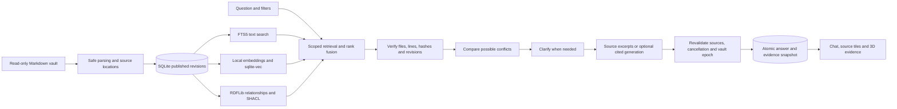

# Obsi Onto — Product Requirements and Technical Specification

Updated: **2026-09-30** · Status: **early development preview**

This document describes the current implementation, configuration, technical boundaries, and validation. The [README](README.md) is the short English guide for installation and everyday use. Historical decisions and completed checks are recorded in the [development log](daily-development-report.md).

## 1. Product scope

Obsi Onto is a local, single-user application for asking questions about an Obsidian vault and inspecting the original evidence and explicit relationships behind the result.

| Requirement | Current behavior |
|---|---|
| Read-only originals | Index local Markdown files without modifying them or inserting IDs. |
| Vault-first onboarding | Ask for a vault before showing chat, suggestions, or knowledge search. A fictional sample vault is available. |
| Useful without an LLM | Return verified excerpts, source tiles, and knowledge graphs without a generation key. |
| Traceable answers | Attach valid source IDs to generated sentences and retain paths, lines, hashes, dates, and revisions. |
| Follow-up conversations | Store chats and retrieve fresh evidence for each question. |
| Source-based clarification | Show possible conflicts and collect clarification scoped to the current answer. |
| Knowledge exploration | Show the whole ready-note map, answer evidence, and reviewed relationships in 3D. |
| Incremental updates | Process file changes and recover missed changes through metadata reconciliation. |
| English defaults | Use English UI and newly generated prose; preserve original user content and quotations. |

The supported deployment target is a computer controlled by one user, currently tested on macOS. Global distribution of an English interface does not imply a public server or multi-user hosting mode.

The app explains recorded thoughts in their original context. A recording date is not an event date, a plan is not completed work, an investment thesis is not a trade, and an old note is not automatically the user's current position.

Out of scope: autonomous note editing, external browsing, trading, exhaustive contradiction detection, automatic quantity/price extraction, arbitrary property-mapping UI, and reconstruction of overwritten pre-index content. General `revises` and `citesAsEvidence` mappings remain follow-up work.

## 2. System architecture

| Layer | Implementation |
|---|---|
| Runtime and entry point | Python 3.12–3.13; `uv`; short `main.py` entry point |
| Local HTTP server | FastAPI and Uvicorn, bound to `127.0.0.1` |
| Storage and text search | SQLite, FTS5, persistent conversations and answer snapshots |
| Semantic search | `sqlite-vec==0.1.6`; local FastEmbed ONNX by default |
| Relationships | RDFLib projection and pySHACL structural validation |
| File notifications | watchdog/FSEvents plus periodic metadata reconciliation |
| Optional generation | OpenAI-compatible `/chat/completions` JSON API |
| Browser interface | Local HTML/CSS/JavaScript; bundled Three.js and OrbitControls |

Python dependencies are locked in `uv.lock`; graph-build dependencies are locked in `package-lock.json`. Node.js is needed for graph development and tests, not normal app use.



The workflow is implemented in Python. It does not use LangGraph or a separate Agent SDK. The model has no autonomous tools. Note text is data, and instructions embedded in notes are not executable commands.

Detailed module and lifecycle diagrams: [architecture](https://github.com/espseongsm/obsi-onto/blob/5897a1846c19d949fada7802115c3f7fd669123a/docs/architecture.md).

## 3. Inputs and ontology

### Files and dates

- Connect one local or iCloud vault by folder path. The operating system handles iCloud synchronization; the app reads files available on this computer.
- Read regular `.md` files only. Exclude `.obsidian`, `.git`, `.trash`, symbolic links, and user-defined vault-relative paths or patterns.
- Split content by headings and paragraphs. Parse bounded YAML/JSON frontmatter, wikilinks, internal Markdown links, heading/block targets, aliases, tags, and source locations.
- Resolve links by paths and names without arbitrarily choosing between ambiguous notes. Report unresolved or ambiguous links in index quality.
- Use titles, tags, and explicit `domain` values for `work`, `investment`, and `personal` scopes. A passage may belong to multiple scopes; `all` includes unclassified content.
- Map frontmatter `topics`, `project`, `company`, and `people` to explicit topics.
- Use `date: YYYY-MM-DD`, or the enabled `YYYY-MM-DD.md` filename rule, as the recording date. Keep modification time and explicitly recorded event dates separate. Missing dates stay unknown.
- Store external URLs as unverified source identifiers. The app does not fetch their contents.

### Entity and relationship contract

| Entity | Meaning |
|---|---|
| Vault / Note | Selected vault and Markdown file, with stable internal ID, current path, aliases, content hash, and revision |
| Section | Citeable passage with a heading, original text, and start/end lines |
| Topic / Tag | Explicit subject or Obsidian tag |
| Claim | Reviewed opinion, decision, principle, or thesis supported by a source quote |
| Activity | Reviewed recorded activity, with planned/completed/unknown state and explicit event date when available |
| Source / Relation | External source identifier or relationship with provenance |

Explicit links and metadata are available without generation. Optional model extraction creates candidates from selected passages; candidates enter confirmed relationship retrieval only after review. Source names and consecutive quotes must occur in the supplied evidence. Reviewed candidates become invalid when their supporting passage or context changes; independently supported reviews are retained.

Extraction is limited to Claim or Activity candidates. Event dates require an ISO date in the quoted source; activity state is planned, completed, or unknown. These fields do not infer an event from a recording date.

Similarity, graph distance, and knowledge-area colors do not create factual relationships. SHACL validates structure and provenance, not the truth or causality of a claim.

Internal IDs are separate from paths. Confirmed moves or renames preserve IDs; ambiguous identity matches are not automatically merged. No IDs are written into original notes.

## 4. Indexing and storage

SQLite is the source of published note and passage revisions. FTS, vectors, evidence, and the RDF projection share passage IDs and source versions. Results must not mix a new source with stale vectors or relationships.

| Trigger | Behavior |
|---|---|
| Initial connection | Index readable Markdown files after applying exclusions |
| Create, edit, move, or delete | Coalesce events; process affected files after a default 2-second settling delay |
| Same-content save | Reuse unchanged embedding inputs; update source-location metadata as needed |
| Start or resume | Reconcile paths, sizes, modification times, and available file identities |
| Periodic reconciliation | Compare metadata when idle, by default every 30 minutes |
| Refresh now | Reconcile metadata and process changes |
| Deep scan | Compare readable content hashes and reuse unchanged embeddings |
| Read/download/permission failure | Retain retry state, exclude unready notes from current answers, and avoid treating failures as deletions |

A resume-check thread waits at most 30 seconds; it does not scan the vault every 30 seconds or wake a sleeping Mac. Closing the browser leaves watching active while the server runs. The next start reconciles changes made while the server was stopped.

Unchanged reconciliation performs no content reads, embedding calls, or RDF revalidation. Metadata cannot detect a missed notification if identity, size, and modification time are all unchanged; Deep scan addresses suspected cases. Answer evidence is reread before use regardless.

Embedding cache keys include the actual input hash, model ID, dimensions, input rules, FastEmbed version, and SHA-256 of local model files. Changing models or dimensions rebuilds vectors; queries use only vectors ready for the new model. A provider silently changing a model under the same ID cannot be detected.

Vector failures preserve text search and retry with backoff from 30 seconds to 30 minutes. Recovering only a vector for unchanged text preserves section ID/revision. Nested SQLite transactions use SAVEPOINTs.

Changes from one note are coalesced to the newest version. Late work cannot overwrite a newer revision. Pending work is recovered on restart. Full RDF/SHACL regeneration, current-vault graph projection, exact vector-distance calculation, and a single SQLite connection remain implementation constraints.

App data includes duplicated passages, embeddings, conversations, jobs, reviews, and answer snapshots. Deleting local index and history removes that app data, including pending jobs and clarifications; it leaves original notes and downloaded public model files intact. It is not forensic secure erasure.

## 5. Retrieval and answer verification

Supported search modes are `lexical`, `semantic`, and `hybrid`. Apply ready-state, exclusion, domain, and recording-date filters consistently across all search paths.

FTS retrieves up to 60 filtered candidates. Semantic retrieval also bounds candidates; rank fusion combines lexical, semantic, and relationship ranks rather than adding incompatible raw scores. Current weighted RRF uses lexical `1`, semantic `0.5`, and relationship `0.15`. Load passage bodies after ranking and deduplicate by common section ID. Relationship expansion uses controlled RDF index traversal.

For every answer:

1. Retrieve evidence from the current published revision.
2. Verify note identity, path, source lines, passage/content hashes, and revision.
3. Compare scoped conflict candidates and collect any required clarification.
4. Generate from verified evidence, or return source excerpts.
5. Recheck evidence, vault epoch, and cancellation before atomic publication.

Generated output uses `{"sentences":[{"text":"...","citations":["S123"]}]}`. Each sentence must cite current evidence IDs. Structure, length, and citation validation are enforced by the server. These checks do not establish semantic correctness; the original passages remain inspectable.

Transport/authentication failures or unsupported response JSON switch to source excerpts. Valid JSON that fails answer/citation validation falls back for that answer without necessarily disabling all generation.

Same-conversation follow-ups may use up to 20 completed turns from the same vault epoch as context. Explicit references to an earlier topic can augment retrieval terms. Prior generated answers are not factual evidence. Changing the vault configuration or exclusions prevents old conversation context from being sent on follow-ups.

Recent chats load up to 50 turns. Legacy single-question records remain readable, but records without a configuration epoch are not automatically used as follow-up context. Saved answers keep their original evidence snapshots and may differ from current files.

## 6. Question jobs and clarification

Jobs and ordered events are persisted in `query_jobs` and `query_events`. Unique request IDs support idempotent submission and clarification. Only one nonterminal question is allowed per conversation.

Actual stages are shown to users: finding evidence, verifying sources, comparing conflicts, awaiting clarification when needed, writing the answer, and rechecking sources. Events contain observed counts and timing rather than invented percentages or model reasoning.

Conflict comparison examines up to 12 retrieved passages plus up to 12 supplemental passages from the same notes under the same filters. Rules can flag differing explicit date fields with the same known recording date. A usable model can suggest other semantic differences. At most three validated issues are asked in sequence; this is not an exhaustive scan or a dedicated opposing-claim search.

Choices are `a`, `b`, `both`, `explain`, or `defer`. No source is preselected. Store clarification separately as `user_clarification`, scoped to `this_answer`. Do not alter notes or confirmed RDF relationships. Deferring keeps unresolved sources and returns a partial excerpt-based answer without generated prose.

A possible conflict is a temporary orange dashed graph overlay, not a confirmed ontology edge. Completed history retains the source pair, choice, explanation, and deferred state.

- Two workers; at most eight active or awaiting-user jobs.
- Keep each job's latest 64 events and terminal job records within the latest 100-job window. Final answer history is stored separately.
- Awaiting-user jobs survive reloads and restarts. Jobs actively running at restart become interrupted.
- Source or vault-epoch changes invalidate old confirmations instead of automatically reusing them.
- Cancellation prevents late publication but does not undo an API request already sent.
- Model and user waits release the common operation lock, allowing indexing and cancellation to continue.
- The UI polls conditionally every 750ms while running, and stops while hidden, awaiting a user, or terminal.
- SSE supports header authentication, bounded replay, up to eight streams, and connections of up to 30 seconds.

Clarification reuse across questions and individual revocation are not implemented. Details: [answer progress and clarification](https://github.com/espseongsm/obsi-onto/blob/5897a1846c19d949fada7802115c3f7fd669123a/docs/answer-progress-and-clarification.md).

## 7. Suggested questions

Generate up to six questions after initial vault connection or a change to path, exclusions, or filename-date interpretation. Saving identical settings, changing refresh timing, reopening the app, and ordinary note edits do not regenerate them.

Use one verified passage from each of up to 24 ready notes, alternating work, investment, personal, and unclassified scopes and favoring recent recording dates within each scope. Each transmitted sample contains at most 120 characters each of title and heading, 600 characters of text, a recording date, and a source ID.

Validate output structure, lengths, cited IDs, and source subject names. Suggestions must reference actual sampled subjects. Set the scope from the cited passages' common classification, otherwise use all notes. This validates the sample contract, not whether retrieval can fully answer every suggestion.

External suggestion generation requires its own opt-in. Without a usable model, permission, or successful output, use actual note-title suggestions. With no valid source content, show an explanation. Store results, timestamps, and source locations in SQLite and reuse them until invalidated. Missing or interrupted suggestions are generated after startup reconciliation.

## 8. Interface and graph contracts

### Language and answer presentation

Use `lang="en"`, English controls/accessibility labels, and English date/time formatting. `uiText()` translates only known system messages and search-route labels at presentation time.

New generated answers, suggested questions, and clarification explanations default to English even with a question, evidence, or previous conversation in another language. Honor a different answer language only when the current question explicitly requests it. Preserve source quotes, extracted names, questions, notes, and existing saved content.

Use 16px answer text and generous line spacing, with supporting material below the answer. **Sources** and **Search & verification** are collapsed initially; **3D evidence graph** is open. Source tiles use two columns, switching to one at chat widths of 320px or less.

Source/citation selection opens the shared original-passage dialog with path, lines, recording date, saved revision, routes, and optional hash. It offers Obsidian and graph navigation, Escape/background dismissal, and focus restoration. Resolve citation IDs within their answer snapshot. Graph selection highlights the matching source without automatically opening the dialog or expanding a collapsed source list.

### Overview, snapshots, and camera

The chat overview includes all indexed, ready notes and connected topics/tags with no note-count cap. Fold actual passage links/properties into note-level connections, preserving provenance counts. Excluded and pending notes are absent.

Independent detailed knowledge search and individual answer snapshots are limited to 80 nodes and 200 links. Default detailed search starts from up to 12 path-ordered notes and nearby two-hop connections; report shown and omitted counts. The combined chat overview/evidence map can exceed those limits.

Answer evidence retains its saved revision. Do not attach current connections to historical evidence when versions differ. Preserve existing node positions, camera, and selection while composing the map. Restoring a conversation starts at the whole-vault view.

A new question starts from the overview, visits at most three relevant locations, and ends by fitting all answer evidence. **Follow evidence**, **All evidence**, and **Stop tour** control the route. Direct camera manipulation cancels automatic movement. The route is visual exploration, not a model reasoning trace.

Graph controls support drag/arrow-key rotation, wheel or +/− zoom, right-button drag or two-finger pan, Home camera reset, Escape selection clearing, and rotation/label toggles. Focus the canvas for keyboard controls; the node selector offers an alternative to selecting a sphere.

### Knowledge areas, themes, and lifecycle

Ten display categories: AI & Models, Data & Analytics, Software & Infra, Work & Projects, Investing & Markets, Economy & Policy, Life & Health, Ideas & Learning, Journal, and Uncategorized.

`GraphCategories.decorate()` copies nodes and scores explicit tag/topic fields at 8, titles/names at 5, and folders at 2. Choose the highest score. Unmatched passages/reviewed records may inherit the source note's area; date-title or journal-folder notes fall back to Journal, otherwise Uncategorized. Expose the category reason. Do not scan source excerpts, invoke a model, alter snapshots, or create links.

Note, passage, topic, tag, reviewed claim, and reviewed activity remain the underlying node types. Selection keeps category colors and adds rings/emphasized connections. Final radii, including degree-based size adjustment, are multiplied by `0.85`.

Light uses cool whites and blue accents; Dark uses black and neutral gray with restrained blue; default AI uses deep blue, cobalt, and cyan. Shared tokens color the UI, graph, labels, legends, and badges. Restore the saved theme before initial paint; theme changes preserve camera, positions, and selection without model calls.

Desktop chat:graph defaults to 1:2. Persist divider ratios in browser storage; enforce minimum widths. Reset button, double-click, or Home restores 1:2; arrows resize, Shift makes larger steps, and Escape cancels a drag. At 1100px or less, stack the graph below chat while retaining the desktop ratio.

Use WebGL 2 for 3D with a node selector/source-inspector fallback. Automatic rotation is off by default and limited to about 30fps when enabled. Reduced-motion preferences skip flights and entrance/selection effects. Hidden/off-screen scenes stop rendering.

`GraphView.watch()` mounts open answer graphs near the viewport. When collapsed or far away, capture coordinates/camera/selection and free GPU resources. Restore them on return; dispose observers and handlers when replacing or deleting conversations.

## 9. Model configuration

`main.py` loads the project `.env` without overriding same-named shell environment variables. Restart after changes. Keep keys in ignored `.env` or the process environment. Missing or invalid generation configuration must leave the app usable in search-only mode.

### Generation API

| Variable | Purpose |
|---|---|
| `OBSI_LLM_URL` | API base URL; the app appends `/chat/completions` |
| `OBSI_LLM_MODEL` | Model ID available at that endpoint |
| `OBSI_LLM_API_KEY` | Server-side API authentication key |
| `OBSI_ALLOW_EXTERNAL_GENERATION=1` | Permit external questions, retrieved/supplemental evidence, clarification, and bounded conversation context |
| `OBSI_ALLOW_EXTERNAL_SUGGESTIONS=1` | Separate permission to transmit sampled content for automatic suggestions; off by default |

The provider must support chat completions and JSON responses. Use HTTPS for external providers and include `/v1` when required. The bundled example model ID is not a promise of provider availability.

`.env.example` uses `OBSI_LLM_URL=${OPENAI_BASE_URL}` and `OBSI_LLM_API_KEY=${OPENAI_API_KEY}`. Either keep these references and fill `OPENAI_*`, or replace them with direct `OBSI_LLM_*` values. Shell-only `OPENAI_*` values are not automatically mapped if those references are removed. Edit existing entries rather than adding duplicates.

A compatible installed local model server at localhost, 127.0.0.1, or ::1 can work without a key or external-transmission opt-in; supply a key if that server requires it.

```sh
OBSI_LLM_URL=http://127.0.0.1:11434/v1 \
OBSI_LLM_MODEL=your-installed-model \
OBSI_LLM_API_KEY= \
uv run main.py
```

Generation requests use JSON response format and omit unsupported temperature overrides. The configured status is not a live provider probe. HTTP/authentication/connection or unreadable-JSON failures disable generation until restart. Valid JSON that fails content/citation checks falls back for the current answer. Local semantic search remains independent.

### Embeddings

Default: `sentence-transformers/paraphrase-multilingual-MiniLM-L12-v2`, 384 dimensions, FastEmbed ONNX on the CPU. **Prepare local search model** downloads public model files; text and explicit relationships are usable beforehand.

| Variable | Purpose |
|---|---|
| `OBSI_EMBEDDING=external` | Select the external adapter |
| `OBSI_EMBED_URL` | HTTPS API base URL |
| `OBSI_EMBED_MODEL` | Embedding model ID; prefer a fixed version |
| `OBSI_EMBED_DIM` | Actual output vector dimensions |
| `OBSI_EMBED_API_KEY` | Server-side authentication key |
| `OBSI_ALLOW_EXTERNAL_EMBEDDING=1` | Separate opt-in for transmitting changed indexed passages and search questions |

Generation opt-in does not enable external embeddings or automatic external suggestions. Model/dimension changes rebuild vectors while text search stays available.

## 10. API and resource limits

Get a token from `GET /api/session` and send `X-Obsi-Token` on every other API, including GET. Never put tokens in URLs. Enforce local host/origin checks and reject external website requests. Serve a self-only content security policy; render user text without executing it.

| Endpoint | Contract |
|---|---|
| `GET /api/status` | Vault, indexing, suggestions, and secret-free generation availability/reason |
| `POST /api/vault`, `POST /api/vault/pick-folder` | Configure the vault or select a macOS folder |
| `POST /api/query-jobs` | Submit question/filters and unique request ID; return 202 and persisted job state |
| `GET /api/query-jobs` | List active or awaiting-user jobs |
| `GET /api/query-jobs/{id}?after={seq}` | Return state or lightweight unchanged response |
| `GET /api/query-jobs/{id}/events` | Bounded SSE replay; support Last-Event-ID and token header |
| `POST /api/query-jobs/{id}/clarifications` | Submit question ID, version, unique request ID, choice, and explanation |
| `POST /api/query-jobs/{id}/cancel` | Cancel publication of the job |
| `POST /api/ask` | Compatibility runner; 200 on completion or 202 awaiting clarification |
| `GET /api/conversations`, `GET /api/conversations/{id}` | List or restore saved chats |
| `GET /api/graph?overview=true` | Ready-note overview with connected topics and tags |
| `GET /api/graph?q=...` | Bounded detailed graph search |

Question requests use `question`, optional `conversation_id`, `domain`, `start`/`end` recording dates, `mode`, `generate`, and `request_id`. Strict models reject unknown fields, blank questions, invalid dates, or reversed date ranges. Request IDs are 16–80 characters using letters, digits, underscore, or hyphen. An `explain` choice requires nonblank explanation text.

| Resource | Limit |
|---|---|
| Question / clarification text | 3,000 / 2,000 characters |
| Mutation request body | 64KiB |
| Note / individual line | 8MiB / 16,384 characters |
| Frontmatter | 64KiB; depth 20; 4,000 nodes; YAML aliases unsupported |
| Generation request JSON | 256,000 bytes |
| Returned model content | 100,000 characters; checked after receipt, not a streaming HTTP-body limit |
| Generated answer | At most 40 sentences; each at most 5,000 characters with 1–24 citations |
| Generation concurrency | Two slots; 60-second request timeout |

Reject special files and symlink traversal. Open sources relative to the vault directory descriptor and verify file identity before/after reading. New data directories use owner-only `0700`; database and lock files use `0600`.

## 11. Running and data locations

| Item | Default |
|---|---|
| Browser address | `http://127.0.0.1:8765`; override with `--port` |
| App data | `~/Library/Application Support/obsi-onto/`; override with `OBSI_DATA_DIR` |
| SQLite/history | `index.sqlite3` and related files in the app data directory |
| File settling delay | 2 seconds; adjustable in Vault settings |
| Idle reconciliation | 30 minutes; adjustable in Vault settings |

The server opens the default browser once ready. File access to `web/index.html` shows launch instructions rather than a working application. No login item is installed.

Keep app data outside the vault and cloud-synced folders. Known iCloud/File Provider paths and paths inside the vault are rejected; other cloud-managed folders still require user judgment. A custom data directory does not automatically move existing data. Only one process may use a data directory. Temporary directories are unsuitable for retained data.

Only one vault is connected at a time. Changing folders requires deleting the previous local index/history. Schema upgrades add job tables and vector-retry columns automatically; stop the old process before starting an updated version.

## 12. Development and validation

```sh
uv run ruff check .
uv run ruff format --check .
uv run pytest -q
node --test tests/*.test.cjs
```

Check syntax for changed browser/build JavaScript with `node --check path/to/file.js`. Rebuild the locally bundled renderer only when necessary:

```sh
npm ci --ignore-scripts --no-audit --no-fund
npm run build:graph
```

Rerun retrieval evaluation with `uv run python scripts/evaluate.py` after preparing the local embedding model. The script does not load `.env`; pass a custom `OBSI_DATA_DIR` in the shell. It uses five fictional notes and 20 Korean questions in a temporary database, forces local embeddings and no generation, and writes `docs/evaluation.json`.

The latest implementation checks passed **102 Python tests** and **24 JavaScript tests**, plus Ruff, JavaScript syntax, and diff whitespace checks. Tests use fictional vaults and model doubles, including macOS file notifications. Restricted environments can block watcher notifications. Existing RDFLib and test-client deprecation warnings remain.

| Existing development measurement | Result and scope |
|---|---|
| Retrieval on five fictional notes / 20 questions | Hit@5 was 20/20 for lexical, lexical+vector, and lexical+vector+relationship paths; lexical ranking was best on this tuned development sample |
| Unchanged five-note reconciliation | Zero content reads, embedding calls, and RDF revalidations; approximately 0.9ms elapsed in one cached run |
| Refactor benchmark on 1,000 synthetic notes | Hybrid search median 131.3→39.9ms; answer without LLM 165.2→79.2ms, using fake embeddings and three-run medians |

These are development measurements, not held-out proof of real-vault quality or performance. Live answer semantics, conflict precision/recall, broad retrieval quality, large-vault resource use, iCloud latency, and sleep/resume behavior need further evaluation.

Acceptance checks cover original-file preservation, exclusions, source versions/citations, all-path filters, update/move/delete recovery, unchanged-input reuse, search-only fallback, cancellation, stale confirmation rejection, durable conversations, graph coordination, and bounded rendering.

Details: [retrieval evaluation](https://github.com/espseongsm/obsi-onto/blob/5897a1846c19d949fada7802115c3f7fd669123a/docs/evaluation.md), [refactor implementation](https://github.com/espseongsm/obsi-onto/blob/5897a1846c19d949fada7802115c3f7fd669123a/docs/refactor-implementation.md), and [benchmark conditions](https://github.com/espseongsm/obsi-onto/blob/5897a1846c19d949fada7802115c3f7fd669123a/docs/refactoring-review.md). Supporting documents and the historical development log retain their original language.

## 13. Preview and documentation

The preview implementation is on `main`. [PR #1](https://github.com/espseongsm/obsi-onto/pull/1) merged the initial MVP into `main`; [PR #2](https://github.com/espseongsm/obsi-onto/pull/2) merged the preview into `feat/initial-mvp` after PR #1 had landed, so it did not reach `main` until [PR #4](https://github.com/espseongsm/obsi-onto/pull/4) merged `codex/initial-preview` into `main`. The README installation command clones the default branch.

Public materials include application code, ontology schemas, fictional examples, tests, technical documents, and a GIF/MP4/poster. The recording uses 80 fictional English notes and source search without an LLM; captions and the closing card were added during editing. It does not demonstrate generated-answer quality.

Exclude `.env`, keys, personal vaults, databases, session files, and personal screenshots from publication. LinkedIn drafts are files only; they have not been posted.

- [README: English quick start and daily use](README.md)
- [Architecture and processing diagrams](https://github.com/espseongsm/obsi-onto/blob/5897a1846c19d949fada7802115c3f7fd669123a/docs/architecture.md)
- [Question scenarios](https://github.com/espseongsm/obsi-onto/blob/5897a1846c19d949fada7802115c3f7fd669123a/docs/question-scenarios.md)
- [Media and LinkedIn drafts](https://github.com/espseongsm/obsi-onto/blob/5897a1846c19d949fada7802115c3f7fd669123a/docs/media/README.md)
- [Development history](daily-development-report.md)

Keep user-facing instructions and concise features in README. Keep configuration details, API/storage contracts, implementation limits, and validation in this specification. Record dated changes in the development log rather than duplicating chronology in the PRD.
